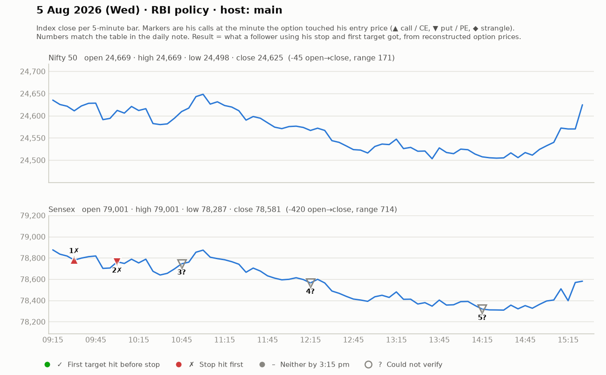

# 5 Aug (Wed; RBI policy day) — u-jxNXi-O_M — MAIN host. Yahoo Nifty O 24669 H 24678 L 24498 C 24625. Sensex focus.
- Pre-mkt: closing-price methodology change discussion (VWAP of last 15 min); gap-up +600 Sensex; "RBI policy at 10am = volatility"; jori video recorded.
## Trades
1. ~9:35 Sensex 79100CE above 280 (SL 265), T 312-314 -> "steam nikal gaya"; viewers 180->197; SL tightened to 274-275 -> small WIN/SCRATCH.
2. ~9:50-10:20 Sensex PE (first a 40-pt-SL idea he flagged as big), then PE that ran +22-23, part-booked; viewers booked 499 ("~96-100 pt move"). WIN.
3. ~10:30-11:30 second 70-80 pt move ("do baar 70-80 point ke munh khane mile"). WIN.
4. ~12:00-12:45 PE: entries 237 (after 209 break), T 228/296 -> 306 -> 365 ("~80 pts"). WIN.
5. ~2:15 PE trend entries 444/521 -> +50, trailed 499-500. WIN.
6. Nifty 24550CE liquidity-bottom idea (2-4 pt risk) and Sensex CE 216 (SL 196) — waited/unclear.
## Teachings
- Sizing example: Sensex lot 20; 10-pt SL on ₹300-400 option = ₹200 risk; then 70-80 pt winners make it worthwhile.
- Part-booking explained: with 2 lots, book one at ~35-40 pts, trail other to entry.
- Don't scratch bottoms ("bottom scratching") under strength level — repeated small SLs.
- Uses EMA/VWAP? Only mentions "EMA, 15 & VWAP fine for Nifty on 3-5 min" when asked (not his core).

## What the market actually did

Index data: 5-minute bars. "Entry hit" is the minute the reconstructed option price first traded at his entry. The follower column uses his stop and first target, else exits at 3:15 pm. Method and caveats: [market-check.md](../market-check.md).

| # | Called | Host | Option (matched strike) | Entry / SL / targets | He said | Entry hit | Market check | Follower |
|---|---|---|---|---|---|---|---|---|
| 1 | 09:35 | main | Sensex CE (78800) | 280 / 15 / 312-314 | SCRATCH +5 | 09:30 | No stated result; stop hit first | Stopped (-1.0R) |
| 2 | 10:00 | main | Sensex PE (79000) | ~450 / 22 / 499 | WIN +45 | 10:00 | Gain came, but his stop was hit first | Stopped (-1.0R) |
| 3 | 10:45 | main | Sensex PE | - / - / - | WIN +70 | — | Not checkable (no time, price, or a strangle) | — |
| 4 | 12:15 | main | Sensex PE | 237 / 22 / 296 / 365 | WIN +75 | — | No strike matched his price | — |
| 5 | 14:15 | main | Sensex PE | 444 / 20 / 546 | WIN +50 | — | No strike matched his price | — |
