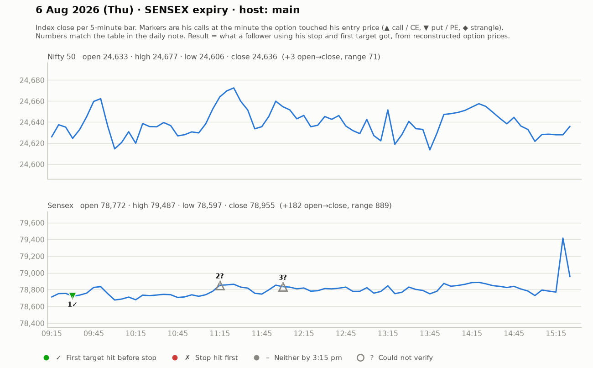

# 6 Aug (Thu, SENSEX expiry) — VRl6SfYXXiQ — MAIN host. Yahoo Nifty O 24641 H 24677 L 24604 C 24636 (narrow; Sensex moved more).
- Pre-mkt: "brutal 3pm candle" previous day; ignore "mother candle" games; plots levels on spot then watches option behaviour; jori/zero-hero ideas for range day.
## Trades
1. ~9:25 Sensex PE above 307 (SL 267-278, ~25-30 — "big, small qty"), T1 359, T2 429-432; tightened SL 299-308; 359 reached, "384-385 fully booked". WIN (~+50-75).
   - Telegram put (11:33) 422 -> 478 (+50) shown later.
2. ~11:00-12:00 Sensex 78800CE bottom buy -> "almost all targets done". WIN.
3. ~12:00 CE above 320 (engulfing; SL 308, ~12), T 364 -> 357-359 then "364 dot touch"; viewers +42 pts. WIN (~+40).
4. Afternoon: 40-pt range chop; avoided 20-SL/40-target trades; PE 336 idea (T 387-388) not clearly taken; jori not triggered (premium ₹200-500).
## Teachings
- "Win rate se zyada achhe trades dekho: 2 trades kharab (small SL), 1 trade bahut badhiya -> overall day profit."
- Plan for 2-3 consecutive losers with ₹10k capital; don't change quantity even after 50 trades; 1-2 lots.
- Don't trade next-expiry for less theta if volumes are thin (slippage).
- Rule of thumb: for 10-12 pt target, a 4-5 pt SL; first 2 pts above entry cover charges.

## What the market actually did

Index data: 5-minute bars. "Entry hit" is the minute the reconstructed option price first traded at his entry. The follower column uses his stop and first target, else exits at 3:15 pm. Method and caveats: [market-check.md](../market-check.md).

| # | Called | Host | Option (matched strike) | Entry / SL / targets | He said | Entry hit | Market check | Follower |
|---|---|---|---|---|---|---|---|---|
| 1 | 09:26 | main | Sensex PE (78800) | 307 / 30 / 359 / 429 | WIN +60 | 09:30 | Matches market: gain reached before his stop | First target hit (+1.7R) |
| 2 | 11:15 | main | Sensex CE | - / - / all targets | WIN +40 | — | Not checkable (no time, price, or a strangle) | — |
| 3 | 12:00 | main | Sensex CE | 320 / 12 / 364 | WIN +40 | — | No strike matched his price | — |
