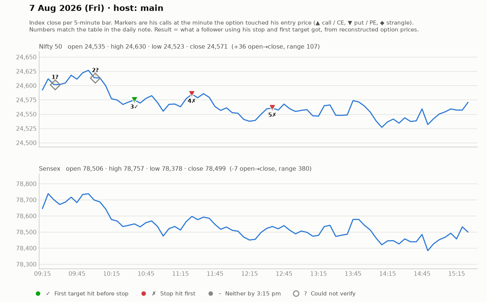

# 7 Aug (Fri) — ayYEP_dKaLY — MAIN host. Yahoo Nifty O 24539 H 24630 L 24523 C 24571 (tight, choppy).
- "Yesterday's (6 Aug) Sensex expiry: we caught good trades early" (Sensex call good; put 422->475). Today Nifty focus; US mildly bearish, Asia down.
## Trades
1. ~9:35 setup above 177 (SL 170, T 189) -> "169 hit ho gaya, kat do" -> LOSS (~7). ("5-6 pt SLs are easily covered; bigger SLs no").
2. ~9:55-10:15 option breakout above 212-216 (SL 203-210; pullback 208-209 green candle), T 234-239 -> no follow-through ("ek single candle ko follow-up nahin"), trailed to BE. SCRATCH.
3. ~10:45 PE above 179 after engulfing at 174-175 (SL 170-175), T 189 -> ~189 reached; re-entry above 189 (T 198/244). small WIN (~+10).
4. ~11:30 PE above 185-186 (two dojis; SL 179-180, 5-6 pts), T 208 -> slow; trail. Small.
5. ~12:15-1:00 PE 191-200 (SL 186-190), T 224/244 — market "10-12 pt either side" day; trailing. small/unclear.
- His remark ~11:45: "aaj ek chhota SL liya hua hai" (one small SL). Explicitly avoided 4-5 trades before 11am to prevent overtrading.
## Teachings
- OTM premium decays faster than ITM; below ₹100 strikes not preferred.
- In tight ranges, breakout traders get trapped; wait for candle that holds above + follow-up.
- On choppy days order blocks/FVGs don't work well — selective trades only.
- "Mid-market zone" -> small risk.

## What the market actually did

Index data: 5-minute bars. "Entry hit" is the minute the reconstructed option price first traded at his entry. The follower column uses his stop and first target, else exits at 3:15 pm. Method and caveats: [market-check.md](../market-check.md).

| # | Called | Host | Option (matched strike) | Entry / SL / targets | He said | Entry hit | Market check | Follower |
|---|---|---|---|---|---|---|---|---|
| 1 | 09:26 | main | Nifty CE/PE | 177 / 7 / 189 | LOSS -7 | — | Not checkable (no time, price, or a strangle) | — |
| 2 | 10:01 | main | Nifty CE/PE | 212-216 / 8 / 234-239 | SCRATCH +0 | — | Not checkable (no time, price, or a strangle) | — |
| 3 | 10:32 | main | Nifty PE (24700) | 179 / 6 / 189 | WIN +10 | 10:35 | Matches market: gain reached before his stop | First target hit (+1.7R) |
| 4 | 11:30 | main | Nifty PE (24750) | 185-186 / 6 / 208 | UNCLEAR | 11:25 | No stated result; stop hit first | Stopped (-1.0R) |
| 5 | 12:30 | main | Nifty PE (24750) | 191-200 / 10 / 224 / 244 | UNCLEAR | 12:35 | No stated result; stop hit first | Stopped (-1.0R) |
