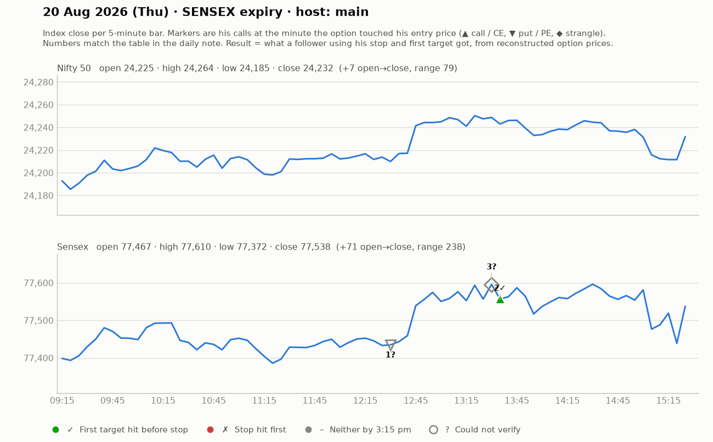

# 20 Aug (Thu, SENSEX expiry) — 2gndmZYrtPw — MAIN host, joined late (~1.9-hr stream; throat/sleep issue). Yahoo Nifty O 24225 H 24265 L 24185 C 24232.
- Says morning Telegram had 2 trades: one put, one call ("call did well"); a viewer claims +118 pts. Bond-yield drop -> gold/BTC up -> Indian mkt up.
## Trades in stream
1. Sensex PE: breakout came with pullback; entry above 354 (SL 328), T 422; avoided false-breakout candle; 358->370 = 50% booked, trail 335-348; re-entry zone 340 (bounce zone, ~15 SL) -> "+40 vs 15 SL". WIN.
   - "Don't take a 3rd entry in the same zone (FOMO)."
2. Sensex CE fast scalp 285 -> ~310 part-book, SL 265, next T 368. small WIN (scalp).
3. Jori: combined premium ~₹1800 -> risk only ~₹900 (half), not to zero. Ended ~cost-to-cost.
## Key philosophy statement
- "I risk ₹500-1000 per trade. When targets go 1:3, 1:4, 1:5, even 50-50 accuracy makes the day profitable."

## What the market actually did

Index data: 5-minute bars. "Entry hit" is the minute the reconstructed option price first traded at his entry. The follower column uses his stop and first target, else exits at 3:15 pm. Method and caveats: [market-check.md](../market-check.md).

| # | Called | Host | Option (matched strike) | Entry / SL / targets | He said | Entry hit | Market check | Follower |
|---|---|---|---|---|---|---|---|---|
| 1 | 12:30 | main | Sensex PE (77700) | 340-354 / 15-26 / 422 | WIN +40 | — | His entry price never traded (per model) | — |
| 2 | 13:32 | main | Sensex CE (77400) | 285 / 20 / 310 / 368 | WIN +20 | 13:35 | Matches market: gain reached before his stop | First target hit (+1.2R) |
| 3 | 13:30 | main | Sensex JORI | ~1800 Rs combined / - / - | SCRATCH +0 | — | Not checkable (no time, price, or a strangle) | — |
