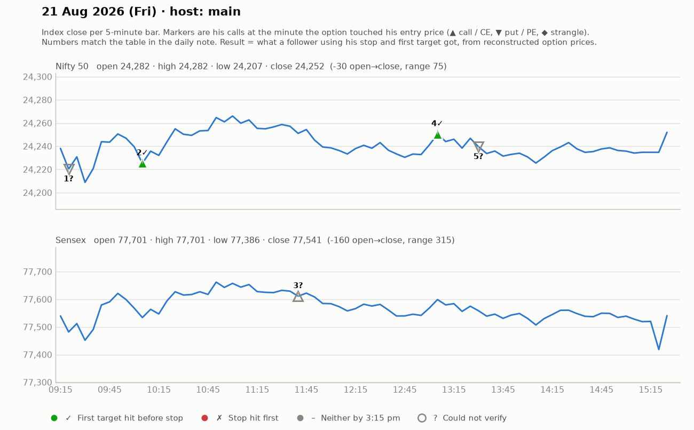

# 21 Aug (Fri) — Gxy5ftj5Z6U — MAIN host. Yahoo Nifty O 24284 H 24284 L 24207 C 24252 (tight ~80-pt range).
- Pre-mkt: after prolonged fall, "first hope of recovery" — needs confirmations (pin bar etc.) at key level; gold/BTC strong. Nifty base zone must hold for bullish rally.
## Trades
1. ~9:20 PE: 9-pt SL vs 14-pt target to distribution zone -> SKIPPED (R:R poor).
2. ~9:45-10:10 Nifty CE (₹150 ITM): wanted pullback to 131-133; entries 136-141 (SL 127.5-135, 5-7 pts), T 164-166 -> "hit ho gaya" (SL). LOSS (~6).
   - Rule stated: after one SL in a setup he doesn't keep re-entering; "after 1-2 setups fail, cool down — discipline".
3. ~11:30 Sensex CE 424-428 (trail 419), T 450 -> T1 hit, trailed. small WIN.
4. ~12:30-1:00 Nifty CE 138-143 (SL 133-137, 4-6 pts), T 153/164 -> +10 then trail. small WIN.
5. ~1:20-1:40 Nifty PE 139 -> 164 (part-book) & Sensex PE above 415-420 (SL ~15), T 461 -> "target hit". WIN.
- His remark: "subah se ₹10 se zyada premium nahin dekh paya" (low-momentum day); "pichhe 6-pt SLs, need net positive day".
## Teachings
- "Second leg (dusra tappa) has less power than first."
- Always decide SL before entry; he prefers cutting a losing trade small even if it later turns.
- Low VIX -> premiums don't move; expect small targets.

## What the market actually did

Index data: 5-minute bars. "Entry hit" is the minute the reconstructed option price first traded at his entry. The follower column uses his stop and first target, else exits at 3:15 pm. Method and caveats: [market-check.md](../market-check.md).

| # | Called | Host | Option (matched strike) | Entry / SL / targets | He said | Entry hit | Market check | Follower |
|---|---|---|---|---|---|---|---|---|
| 1 | 09:20 | main | Nifty PE | - / 9 / - | SKIPPED | — | Not checkable (no time, price, or a strangle) | — |
| 2 | 09:46 | main | Nifty CE (24200) | 136-141 / 6 / 164-166 | LOSS -6 | 10:05 | He exited early; stop not hit | First target hit (+4.7R) |
| 3 | 11:30 | main | Sensex CE (77800) | 424-428 / - / 450 | WIN +12 | 11:40 | Matches market: gain reached before his stop | — |
| 4 | 12:45 | main | Nifty CE (24250) | 138-143 / 5 / 153 / 164 | WIN +10 | 13:05 | Matches market: gain reached before his stop | First target hit (+3.0R) |
| 5 | 13:30 | main | Nifty/Sensex PE (24400) | 139 / 415-420 / - / 164 / 461 | WIN +30 | — | His entry price never traded (per model) | — |
