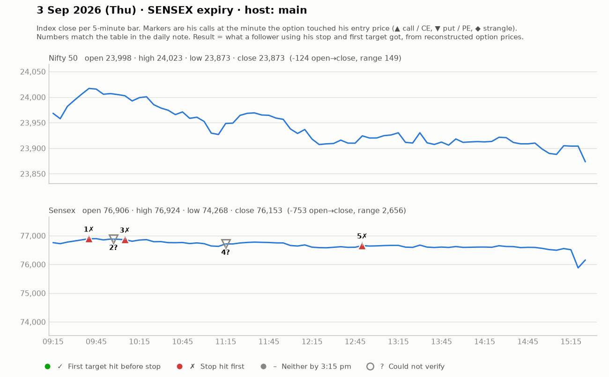

# 3 Sept (Thu, SENSEX expiry) — vK9x0XEwaAg — MAIN host. Yahoo Nifty O 23998 H 24025 L 23873 C 23873 (down into close).
- Prior day (2 Sept, he was absent most of day): Telegram CE 282-292 @12:25 -> 383 (~100 pts); 1:30 put reached 2nd target. Viewers "40% ROI".
- Pre-mkt: Asia green (Japan +2.6%); Sensex 76760-76800 band = resistance (old support); 76500 support. Prefers slightly ITM strikes (intrinsic value).
## Trades
1. ~9:30 Sensex CE: aggressive 286-290 (SL day-low) or strong-buy above 303 (SL 275, ~26-28 pts), T 376/383. 320 broke -> 340 part-book, trail 291->339->351; viewer exited 362 "top". WIN (~+50-60).
2. ~10:15 PE follow-up above 371-372 (SL 357, ~15-20), T ~405-410 (admits 1:1.5 only, support below) -> modest; trail 359. small WIN/scratch.
3. ~10:30 CE bounce scalp 368-377 -> +20. small WIN.
4. ~11:00-11:45 PE ideas above 480/500 (SL ~30) — "risky", outcome unclear.
5. ~12:45 CE (cheaper strike ~₹194, SL 180, 12-14 pts), T1 236 -> hit; 240 break -> T2 315-320; "240 entries got +30". Nifty CE 150->170 too. WIN.
- Day: "two calls came out today (Sensex + Nifty), both good".
## Teachings
- If option is ₹500 vs ₹300 the SL becomes bigger -> pick ~₹300 (Sensex) for manageable SL.
- Hack: after entry, first move SL to entry once the option moves ~SL distance in favour.
- Keep a primary SL in system even if using someone else's analysis.

## What the market actually did

Index data: 5-minute bars. "Entry hit" is the minute the reconstructed option price first traded at his entry. The follower column uses his stop and first target, else exits at 3:15 pm. Method and caveats: [market-check.md](../market-check.md).

| # | Called | Host | Option (matched strike) | Entry / SL / targets | He said | Entry hit | Market check | Follower |
|---|---|---|---|---|---|---|---|---|
| 1 | 09:31 | main | Sensex CE (76600) | 286-303 / 15-28 / 376 / 383 | WIN +55 | 09:40 | Matches market: gain reached before his stop | Stopped (-1.0R) |
| 2 | 09:57 | main | Sensex PE | 371-372 / 15 / 405-410 | SCRATCH +5 | — | No strike matched his price | — |
| 3 | 10:10 | main | Sensex CE (76500) | 368-377 / 15 / ~397 | WIN +20 | 10:05 | Target and stop in the same minute | Stopped (-1.0R) |
| 4 | 11:15 | main | Sensex PE | 480 / 30 / - | UNCLEAR | — | No strike matched his price | — |
| 5 | 12:45 | main | Sensex CE (76800) | 194 / 14 / 236 / 320 | WIN +35 | 12:50 | Claimed gain not reached | Stopped (-1.0R) |
