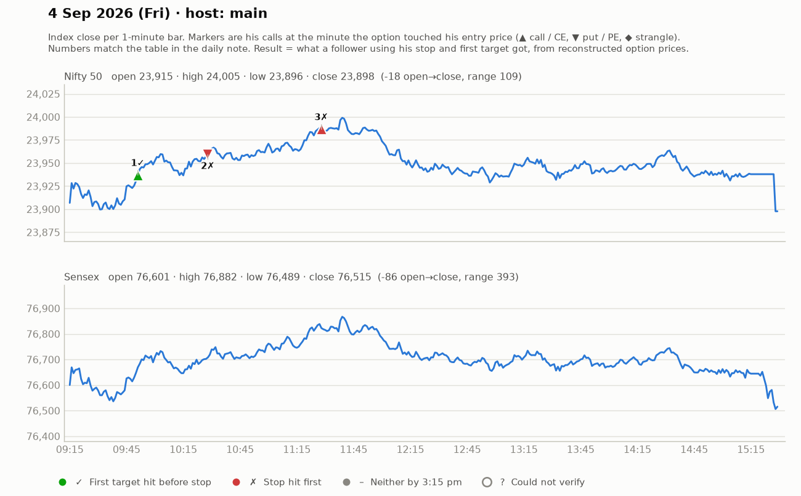

# 4 Sept (Fri) — YtqPA0aKkzE — MAIN host. Yahoo Nifty O 23911 H 24006 L 23896 C 23898. Nifty focus.
- "Yesterday's jori super hit." Key level 23900 (yesterday's support/close). Strikes 23900CE, 24500?PE (~₹140-150).
## Trades
1. ~9:45 23900CE: refused early entries (3 green candles, SL too big); trigger above 136 after candle close + follow-up, SL 130, T1 149, T2 168; pullback 134-136 also ok. T1 hit ~10:05, trail 139/151; "22-pt trade". WIN.
2. ~10:00 PE reversal above 134 (SL 129), T 145/156 -> moved +7-8, BE advised, then faded ("put strength gone") -> SCRATCH/small LOSS for holders.
3. ~11:00-11:30 CE pullback 150-157 (SL 150), T1 168 -> T2 204 (24000 level); T1 hit, viewers 157->~177 (+20); "167-168 entries also got 10". WIN.
## Teachings
- Breakouts that "the whole world is watching" fail more often — prefer pullback entry.
- Shakeout = drop below swing lows where many SLs sit; after shakeout, enter.
- SL is part of the system — take it gracefully, but keep it as small as possible; trail from below to see big profits.
- Phrases: "bottom piking mat karo", "single-candle SL entries".

## What the market actually did

Index data: 1-minute bars. "Entry hit" is the minute the reconstructed option price first traded at his entry. The follower column uses his stop and first target, else exits at 3:15 pm. Method and caveats: [market-check.md](../market-check.md).

| # | Called | Host | Option (matched strike) | Entry / SL / targets | He said | Entry hit | Market check | Follower |
|---|---|---|---|---|---|---|---|---|
| 1 | 09:40 | main | Nifty CE (23900) | 136 / 6 / 149 / 168 | WIN +18 | 09:51 | Matches market: gain reached before his stop | First target hit (+2.2R) |
| 2 | 09:59 | main | Nifty PE (24050) | 134 / 5 / 145 / 156 | SCRATCH -3 | 10:28 | No stated result; stop hit first | Stopped (-1.0R) |
| 3 | 11:16 | main | Nifty CE (23950) | 150-157 / 6-8 / 168 / 204 | WIN +15 | 11:28 | Claimed gain not reached | Stopped (-1.0R) |
