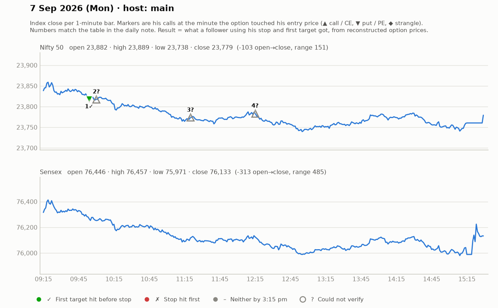

# 7 Sept (Mon) — JhSkNorpW6w — MAIN host. Yahoo Nifty O 23883 H 23890 L 23738 C 23779.
- Pre-mkt: US fine, Asia mixed; crude gap-up (negative); bearish phase continuing; "drop zone" = where consolidation broke & fresh selling started (trapped buyers -> supply zone). Opening ~15 pts down at that zone; below 23800 sustain -> shorts (80-pt scope).
## Trades
1. ~9:28 24000PE follow-up above 178 (SL 164, ~15 pts, "bigger than usual"), T 204-205 (he notes ~1:1). No momentum; SL tightened 166-168 -> exited/stopped. SCRATCH/small LOSS.
2. ~10:00 CE at 135-138 (SL 128-129 swing low), T 179-183; day-high 143 break -> trail 132/135; part-book 151-152, trail 144-148. WIN (~+15-20).
3. ~11:20 CE consolidation breakout 152-155 (SL 148, 6-7 pts), T 181-182 -> 156->169, trailed out. WIN (~+13).
4. ~12:15 CE reversal ~107-110 (SL 107 / 6-7 pts), T1 124-125 (hit), T2 138. "Hat-trick: 3 trades back-to-back". WIN.
- Mentions: "3 expiries: only one ₹1300 SL in jori, rest doubled/tripled".
## Teachings
- Drop zone / supply zone concept (fresh selling from a pullback where previous buyers are stuck).
- Don't take reversal on 1-2 candles; wait for reversal indications; repeated pin-bar hopes => overtrading.
- In low-momentum markets, plan 3-5 pt SLs that you can take "happily".
- Credit/bear spreads for capital-rich viewers (hedged).

## What the market actually did

Index data: 1-minute bars. "Entry hit" is the minute the reconstructed option price first traded at his entry. The follower column uses his stop and first target, else exits at 3:15 pm. Method and caveats: [market-check.md](../market-check.md).

| # | Called | Host | Option (matched strike) | Entry / SL / targets | He said | Entry hit | Market check | Follower |
|---|---|---|---|---|---|---|---|---|
| 1 | 09:28 | main | Nifty PE (24000) | 178 / 15 / 204-205 | SCRATCH -5 | 09:54 | No stated result; 2R reached first | First target hit (+1.7R) |
| 2 | 10:00 | main | Nifty CE (23750) | 135-138 / 8 / 179-183 | WIN +15 | — | His entry price never traded (per model) | — |
| 3 | 11:20 | main | Nifty CE (23700) | 152-155 / 6 / 181-182 | WIN +13 | — | His entry price never traded (per model) | — |
| 4 | 12:15 | main | Nifty CE (23750) | 107-110 / 7 / 124 / 138 | WIN +15 | — | His entry price never traded (per model) | — |
