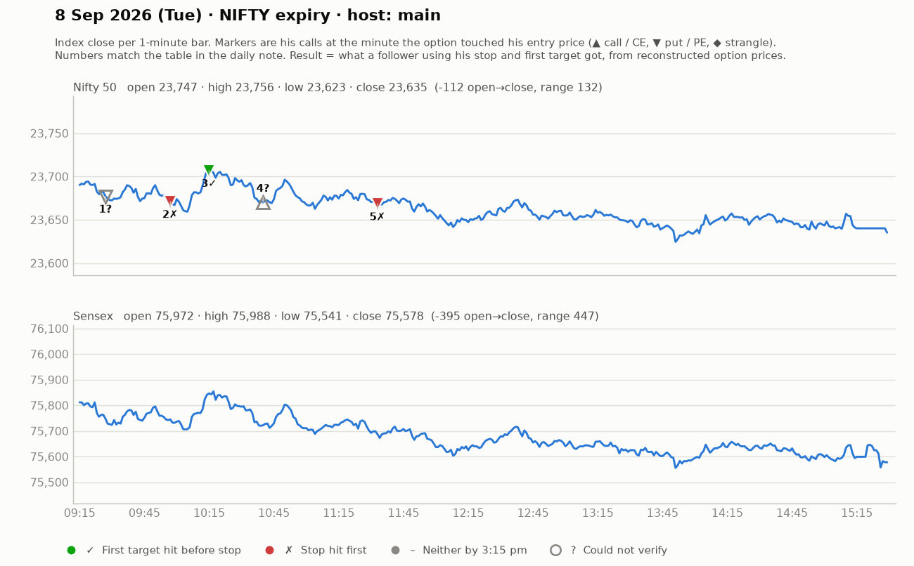

# 8 Sept (Tue, NIFTY expiry) — s3r5EJy4cw8 — MAIN host. Yahoo Nifty O 23743 H 23759 L 23623 C 23635 (down day).
- Pre-mkt: markets "khasta"; rupee depreciation & FII outflows explained (macro teaching); no green candle getting follow-up; support 23780-23800 broke yesterday; target zone 23628. "Don't touch the first tick."
## Trades (puts mostly; ~₹150 strikes)
1. ~9:22 PE follow-up above 160 (SL 153, ~7 pts), T1 178, T2 184 -> 170, part-book +10, trailed 163-165. small WIN.
2. ~9:50 PE pullback 157-159 (SL 153) -> 169 (+10, "VIP"); second trade +9. small WIN.
3. ~10:00 PE barcode/consolidation breakout above 180 (SL 171-172), T 198-199 (later 209) -> "+16" for 184 entries, trailed BE. WIN.
4. ~10:40 23550CE reversal attempts 141-145 (SL 135-139), T 154-155/173 -> some +10-24 ("149->173"), others SL'd (stop-hunt not completed). MIXED.
5. ~11:30 23850PE ~121 entry -> trailed 182-183 (big); PE pullback 173-174 (SL 167), T 198/209. WIN.
- Day: trend-down, multiple put wins; counter-trend calls scratchy.
## Teachings
- Wait for the stop-hunt below a consolidation (pin bar) before buying reversal; if breakout comes without stop-hunt, SL = consolidation low.
- "Barcode breakout" trades = extended; trail fast.
- Breakout handling: enter when a candle breaks the level; SL = that candle's low (small) — avoids being trapped at top.
- A viewer raised risking 1-2% of capital per trade (not clearly endorsed by him).
- Month-end put holders: 2-3 day view only with clear SL (23700).

## What the market actually did

Index data: 1-minute bars. "Entry hit" is the minute the reconstructed option price first traded at his entry. The follower column uses his stop and first target, else exits at 3:15 pm. Method and caveats: [market-check.md](../market-check.md).

| # | Called | Host | Option (matched strike) | Entry / SL / targets | He said | Entry hit | Market check | Follower |
|---|---|---|---|---|---|---|---|---|
| 1 | 09:27 | main | Nifty PE (23850) | 160-162 / 7 / 178 / 184 | WIN +10 | — | His entry price never traded (per model) | — |
| 2 | 09:47 | main | Nifty PE (23800) | 157-159 / 5 / 178 | WIN +10 | 09:57 | Matches market: gain reached before his stop | Stopped (-1.0R) |
| 3 | 10:06 | main | Nifty PE (23850) | 180 / 8 / 198-199 / 209 | WIN +16 | 10:15 | Matches market: gain reached before his stop | First target hit (+2.2R) |
| 4 | 10:40 | main | Nifty CE | 141-145 / 6 / 154 / 173 | SCRATCH +0 | — | No strike matched his price | — |
| 5 | 11:30 | main | Nifty PE (23700) | ~121 / 173 / 6 / 182 / 198 | WIN +45 | 11:33 | Claimed gain not reached | Stopped (-1.0R) |
