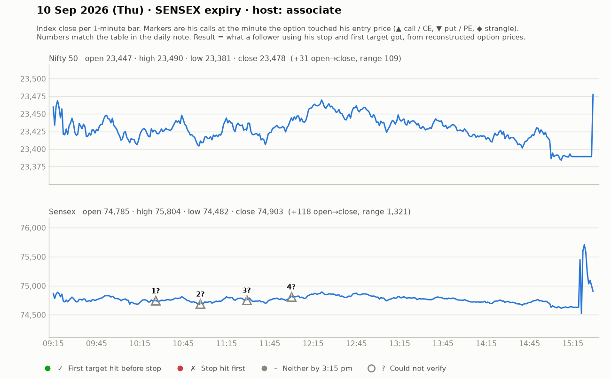

# 10 Sept (Thu, SENSEX expiry) — _v3ieKuYGRc — ASSOCIATE all day (Chinmay "has fever"). Yahoo Nifty O 23447 H 23495 L 23380 C 23478.
- Method recap (associate explains): SL & targets on SPOT/index levels (not premium); enter at whatever premium when 15-min/1-min candle CLOSES beyond "black line"; targets = standard-deviation levels (SD2, SD4); partial booking at 20 pts premium.
- Shows prior sheet of SLs: 12,12,10,19 (Sensex),7,10,-3,1,7,4,6 pts — "SLs are small".
- Trades: 74700CE close-above entry ~218 -> +15 (part-book), trailed to cost; 74600CE at ~255 after seller SLs taken -> +40-65 (target 70 almost) WIN; re-entry 239 -> +13-15; later CE +50 then sudden dump -> exited at cost. Net: positive day.
- Advice: after big losses (viewer -47k), take a break; don't do entry-exit-entry-exit (that's not trading); don't be greedy — 30-40 pts fine.

## What the market actually did

Index data: 1-minute bars. "Entry hit" is the minute the reconstructed option price first traded at his entry. The follower column uses his stop and first target, else exits at 3:15 pm. Method and caveats: [market-check.md](../market-check.md).

| # | Called | Host | Option (matched strike) | Entry / SL / targets | He said | Entry hit | Market check | Follower |
|---|---|---|---|---|---|---|---|---|
| 1 | 10:26 | associate | Sensex CE | ~218 / - / SD levels | WIN +15 | — | No strike matched his price | — |
| 2 | 10:57 | associate | Sensex CE | ~255 / - / 70 | WIN +55 | — | No strike matched his price | — |
| 3 | 11:29 | associate | Sensex CE | ~239 / - / - | WIN +14 | — | No strike matched his price | — |
| 4 | 12:00 | associate | Sensex CE | - / - / 50 | SCRATCH +0 | — | Not checkable (no time, price, or a strangle) | — |
