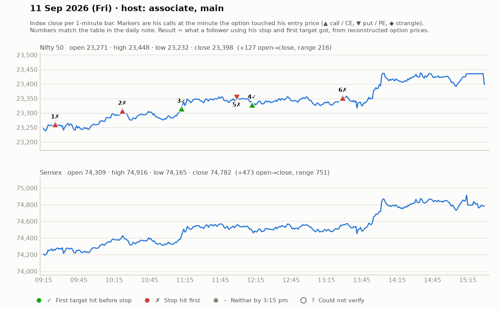

# 11 Sept (Fri) — qTDwaNEZ2RY (MAIN host, ~9:05-12:40, "much better" after illness) + qEYKvXFibAU (ASSOCIATE afternoon). Yahoo Nifty O 23270 H 23448 L 23231 C 23398 (gap-down then strong rally).
## Main host
1. ~9:30 CE: small candles at zone ("small candles = blast"), entry above 178-181 (SL 169-171, 7-11 pts), T 209-210 -> failed ("ye trade work nahin kiya") -> LOSS (~10).
2. ~10:05 CE re-attempt (3rd attempt) above 182-190 (SL 173, "bigger SL -> small qty"), T 210 then 244 -> 210 "dot touch", trailed 197-200. WIN (~+20-25). Pullback buyers 174-175 (4-5 pt SL).
3. ~10:45 CE 128 (SL day-low, 8-10 pts), T 139/155 -> stalled, trailed 123 -> BE exit. SCRATCH.
4. ~11:30 CE green-candle entry 245-250 (SL 236-245), T1 268, T2 294 -> 268 touched, then trailed 249. small WIN.
5. ~12:00 PE reversal only above 161 (SL 150-152), T 196/227 — outcome not shown.
- Teaching: "pullback needs a prior aggressive move (~100 pts) to be trustworthy"; "one good trade per day with great R:R is the aim — accept a missed/failed entry"; risk 4-5 pts preferred, 8-10 max for Nifty options; "make-or-break zone" framing.
## Associate (afternoon)
- 23200/23300CE at confluence + candle close above black line; 142 entry (SL ~10) -> stopped quickly (-6); 128 entry -> +10 then trailing; "2 times 10 pts given"; "3pm big candle risk — book". Net small.
- States: "as a SEBI-registered RA we're not allowed to trade in what we recommend" (claimed).

## What the market actually did

Index data: 1-minute bars. "Entry hit" is the minute the reconstructed option price first traded at his entry. The follower column uses his stop and first target, else exits at 3:15 pm. Method and caveats: [market-check.md](../market-check.md).

| # | Called | Host | Option (matched strike) | Entry / SL / targets | He said | Entry hit | Market check | Follower |
|---|---|---|---|---|---|---|---|---|
| 1 | 09:28 | main | Nifty CE (23150) | 178-181 / 9 / 209-210 | LOSS -10 | 09:25 | Loss confirmed | Stopped (-1.0R) |
| 2 | 10:14 | main | Nifty CE (23200) | 182-190 / 12 / 210 / 244 | WIN +22 | 10:22 | Gain came, but his stop was hit first | Stopped (-1.0R) |
| 3 | 10:50 | main | Nifty CE (23300) | 128 / 8-10 / 139 / 155 | SCRATCH +0 | 11:12 | No stated result; 2R reached first | First target hit (+1.4R) |
| 4 | 11:38 | main | Nifty CE (23150) | 245-250 / 8 / 268 / 294 | WIN +18 | 12:12 | Matches market: gain reached before his stop | First target hit (+2.9R) |
| 5 | 12:01 | main | Nifty PE (23500) | 161 / 10 / 196 / 227 | UNCLEAR | 11:59 | No stated result; 2R reached first | Stopped (-1.0R) |
| 6 | 13:02 | associate | Nifty CE (23350) | 142 / 128 / 10 / - | SCRATCH +2 | 13:29 | No stated result; stop hit first | Stopped (-1.0R) |
