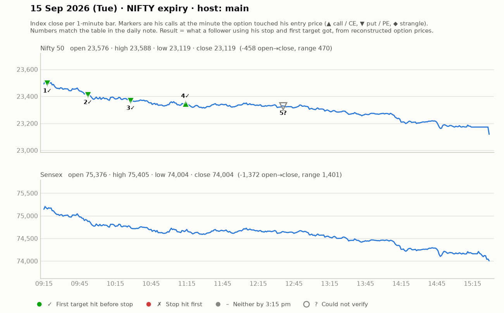

# 15 Sept (Tue, NIFTY expiry) — JBPc4_cTou4 — MAIN host. Yahoo Nifty O 23576 H 23593 L 23119 C 23119 — gap-up then -457 pt (open-to-close) trend-down day.
- Pre-mkt: gap-up after big weekend; "don't assume bullish"; key resistance 23380-23400 (wait, open 23576 above); 23480 must sustain else puts; HTF 23080 likely test. Strikes 23400CE, 23650PE (~₹150).
- Overnight call holders: watch first 1-min candle; book half at a good morning tick ("half profit ghar le jao").
## Trades
1. ~9:22 23650PE above 172 (follow-up), SL 160-161 (12-13 pts), T1 199-200, T2 235, T3 256, T4 309. Trail 170->188->194->226->246->254->259. All of T1-T3 hit; trailed out ~254-259. WIN (~+80 on 12 risk).
2. ~9:45 PE higher-high add above 200/213 (SL 188/201), T 235 -> hit. WIN.
3. ~10:15 23500PE triangle consolidation break above 152 (SL 143), T 187 (supply zone/morning distribution) -> 173+, trail 158-164, "hat-trick, every target achieved". WIN.
4. ~11:00-11:30 CE reversal attempts at 118-124 (SL 105-114) after stop-hunt -> "ek bara stop los bhi aya" (~15-16). LOSS.
5. ~12:20 23500PE continuation above 190 (SL 175-187), T 202+ ; viewers 23600PE 134 -> 293. WIN.
- Day: big trend day, mostly puts; one larger SL on a counter-trend call.
## Teachings
- "Oversold" is not a reason to buy calls; wait for absolute strength (break of structure).
- Use ~₹150 slightly ITM strikes for direction (ATM was ₹70) — cheap OTM on expiry = gambling.
- Break-and-follow rule: take the candle that breaks the big candle's high, SL at that candle's low -> avoids false breakouts.
- 1-lot traders: book half? -> use 2 lots: book 1 at ~1:1, trail the other; practise taking system SLs.
- Small capital pushes people to zero-hero trades; ₹700-800 risk per trade needs ~₹12-13k capital.
- Jori: SL ~₹1300-1400 per pair, target ₹2200-2500; max SL he'd accept ~₹1600.

## What the market actually did

Index data: 1-minute bars. "Entry hit" is the minute the reconstructed option price first traded at his entry. The follower column uses his stop and first target, else exits at 3:15 pm. Method and caveats: [market-check.md](../market-check.md).

| # | Called | Host | Option (matched strike) | Entry / SL / targets | He said | Entry hit | Market check | Follower |
|---|---|---|---|---|---|---|---|---|
| 1 | 09:23 | main | Nifty PE (23650) | 172 / 12 / 200 / 235 / 256 / 309 | WIN +80 | 09:18 | Matches market: gain reached before his stop | First target hit (+2.3R) |
| 2 | 09:43 | main | Nifty PE (23600) | 200-213 / 10 / 235 | WIN +25 | 09:52 | Matches market: gain reached before his stop | First target hit (+3.5R) |
| 3 | 10:15 | main | Nifty PE (23400) | 152 / 9 / 187 | WIN +25 | 10:28 | Matches market: gain reached before his stop | First target hit (+3.9R) |
| 4 | 11:07 | main | Nifty CE (23400) | 118-124 / 15 / 139-163 | LOSS -15 | 11:14 | He called it a loss; market reached 2R first | First target hit (+1.4R) |
| 5 | 12:36 | main | Nifty PE (23350) | 190 / 10 / 202+ | WIN +20 | — | His entry price never traded (per model) | — |
