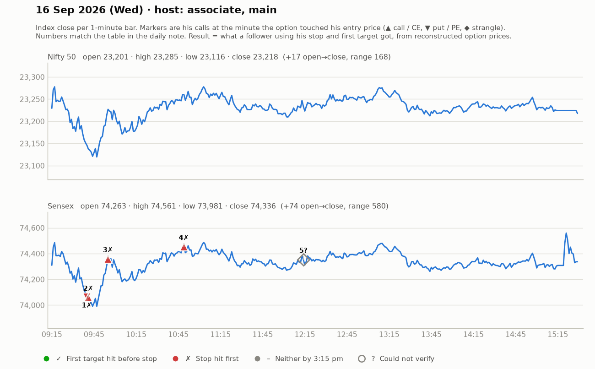

# 16 Sept (Wed) — MK1NfHWN24M — MAIN host 9:05-~11:30, then ASSOCIATE (Swapnil/Trade Circuit). Yahoo Nifty O 23202 H 23285 L 23116 C 23218. Sensex focus (expiry Thu).
- Pre-mkt: previous day big red candle; crude cooling; Asia +0.5-0.75% -> "repulsive bounce after big sell-off — don't go aggressively bullish until key levels taken out". Puts expensive -> premium cool-off at open; don't enter first ticks.
- Sensex: 74200 zone must be reclaimed; 250-pt trading range; 73300-73400 HTF support; shorting near 74450.
## Trades (main host)
1. ~9:30 PE consolidation breakout above 310 (SL 275, ~35 pts), T 365 then 408-410 -> +50-60, viewers exit 437. WIN.
2. ~9:45 CE above 324-325 (SL 294-295 day-low) -> stopped / re-entry later.
3. ~10:00 CE doji at 319-320 -> entry above 320 (SL 293, ~20-27 pts), T 446 -> ran ~75 pts to ~400; "everyone should have got 50+". WIN.
4. ~11:00 74300CE breakout above 410 (SL 378-380), T 465/499 -> "attempt kiya, reward kuch khas nahin" -> small LOSS/scratch.
- Telegram: Nifty CE 139 entry -> large move claimed.
## Associate afternoon
- 15-min expansion/structure-shift; entries 370, 315, 325 with SL on spot level; several cost-to-cost exits, trailing SL hits; "today risky day" -> net small.
## Teachings
- Re-entry discipline: after an SL, if setup re-forms, re-enter — trust setup.
- Charges are a cost: compute break-even incl. charges.
- Reversal only after the trapped side is clear (put must close above breakdown level first).

## What the market actually did

Index data: 1-minute bars. "Entry hit" is the minute the reconstructed option price first traded at his entry. The follower column uses his stop and first target, else exits at 3:15 pm. Method and caveats: [market-check.md](../market-check.md).

| # | Called | Host | Option (matched strike) | Entry / SL / targets | He said | Entry hit | Market check | Follower |
|---|---|---|---|---|---|---|---|---|
| 1 | 09:30 | main | Sensex PE (74000) | 310 / 35 / 365 / 408-410 | WIN +55 | 09:40 | Claimed gain not reached | Stopped (-1.0R) |
| 2 | 09:39 | main | Sensex CE (74100) | 324-325 / 30 / ~395 | LOSS -30 | 09:41 | Loss confirmed | Stopped (-1.0R) |
| 3 | 09:59 | main | Sensex CE (74400) | 320 / 27 / 446 | WIN +65 | 09:55 | Claimed gain not reached | Stopped (-1.0R) |
| 4 | 10:52 | main | Sensex CE (74300) | 410 / 30 / 465 / 499 | LOSS -10 | 10:49 | Loss confirmed | Stopped (-1.0R) |
| 5 | 12:14 | associate | Sensex CE/PE | 370 / 315 / 325 / - / - | SCRATCH +0 | — | Not checkable (no time, price, or a strangle) | — |
