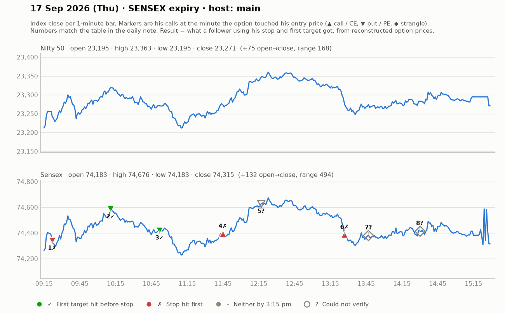

# 17 Sept (Thu, SENSEX expiry) — njvG_Pr9CpM — MAIN host (back after being unwell). Yahoo Nifty O 23195 H 23364 L 23194 C 23271.
- Pre-mkt: US flat/red; Asia mixed; crude at highs (key: breaks below ~101 = positive). Sensex open 74182 below yesterday's base 74250; resistance 74480-74500; scope down to 74000. Strikes 74100CE / 74500PE (~₹290-300).
- Shows Telegram record: prior day CE 279-283 -> 394 (+100); a put trade also good.
## Trades
1. 9:28 74500PE: first pin bar at key zone, entry above 292-293, small risk, T1 335 (hit ~9:40), next 404/415; trail 284->309; "smooth entry, +40-50". WIN.
2. ~9:50-10:20 PE continuation: accumulation 410-430, T 533 -> "535 touched"; viewers 381->501 (+120). Telegram put 287->368->500+. WIN (big).
3. ~11:00 PE (new strike) reversal: zone 230 / pullback 210-212, SL ~210 (20 pts), T 291 (distribution) -> "291 exit mila". WIN (~+60-80).
4. ~11:40 CE higher-high 325 (SL 308), T 385-386 then 414 -> "413 dot" (resistance). WIN (~+60-85).
5. ~12:15 74700PE 182-183 (SL day-low), T1 224, T2 280 — outcome unclear.
6. ~1:00 CE 305 (SL 274-277), slow for 17 min, 340 -> T1 373 -> ~405 ("+80-100", "mega trade"). WIN.
7. ~1:40 JORI #1 74300PE + 74400CE (combined ~Rs240, SL ~Rs110, T +150-200): reached ~280 (+40-60 net) -> WIN. JORI #2 (~2:30, same strikes): "dusri vali complete fail" -> LOSS (next day: "kal ka jori zero").
- Viewer claim: "350 points captured in 2 trades". Strong day per him.
## Teachings
- Reversal only when you know who is getting trapped (put buyers + call sellers trapped -> momentum).
- Pin bars count only at bottom or at retest, not random.
- Strike: Nifty ~₹150, Sensex ~₹300 (slightly pricier Nifty so 5-10 pt moves matter).
- Uses OI only as context (74500CE 48 lakh OI = resistance; call writers' last attempt).
- Mid-day: tiny SL (8-10 pts), small qty.

## What the market actually did

Index data: 1-minute bars. "Entry hit" is the minute the reconstructed option price first traded at his entry. The follower column uses his stop and first target, else exits at 3:15 pm. Method and caveats: [market-check.md](../market-check.md).

| # | Called | Host | Option (matched strike) | Entry / SL / targets | He said | Entry hit | Market check | Follower |
|---|---|---|---|---|---|---|---|---|
| 1 | 09:24 | main | Sensex PE (74500) | 292-293 / 12 / 335 / 404 / 415 | WIN +45 | 09:22 | Gain came, but his stop was hit first | Stopped (-1.0R) |
| 2 | 09:50 | main | Sensex PE (74600) | 381-430 / 25 / 533 | WIN +100 | 10:11 | Matches market: gain reached before his stop | First target hit (+6.1R) |
| 3 | 10:49 | main | Sensex PE (74300) | 212-230 / 20 / 291 | WIN +65 | 10:52 | Matches market: gain reached before his stop | First target hit (+4.0R) |
| 4 | 11:36 | main | Sensex CE (74200) | 325 / 17 / 385 / 414 | WIN +70 | 11:45 | Gain came, but his stop was hit first | Stopped (-1.0R) |
| 5 | 12:08 | main | Sensex PE (74400) | 182-183 / - / 224 / 280 | UNCLEAR | 12:17 | No stated result; no stop given | — |
| 6 | 13:14 | main | Sensex CE (74200) | 305 / 30 / 373 / 480 | WIN +85 | 13:27 | Gain came, but his stop was hit first | Stopped (-1.0R) |
| 7 | 13:47 | main | Sensex JORI | 240 combined / 110 / +150-200 | WIN +45 | — | Not checkable (no time, price, or a strangle) | — |
| 8 | 14:30 | main | Sensex JORI | ~245 combined / 110 / +150 | LOSS -110 | — | Not checkable (no time, price, or a strangle) | — |
