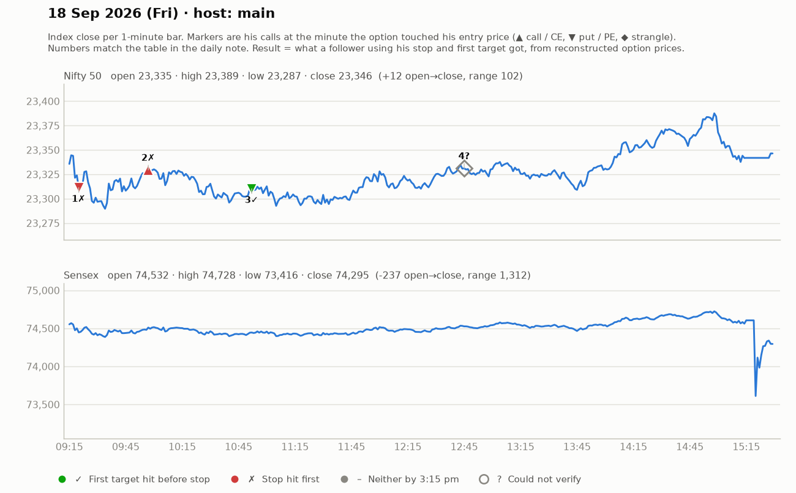

# 18 Sept (Fri) — EPh5qxWEUhU — MAIN host. Yahoo Nifty O 23335 H 23389 L 23287 C 23346 (very narrow ~100-pt range).
- Pre-mkt: gap-up +64; US Senate tariff bill risk; crude cooling; China/HK/Kospi green; NSDL IPO soaking liquidity -> low volumes. Strikes ~₹130: 23300CE, 23400PE.
## Trades
1. 9:25 23400PE pullback (pullback candle then entry), SL 138->142, T1 169, T2 187; +15 pts rally, part-book ~160, trail 154-159 -> trailed out. small WIN (~+15).
2. ~9:50 23300CE consolidation break above 124, SL 116-117 (6-8 pts), T 136/156; re-entry 129 SL 123; range-bound -> exits ~BE/SL (viewer "₹900 loss"). small LOSS/scratch.
3. ~10:45 23400PE 150-156, SL 144-146, T 166/179 -> BE / cut. SCRATCH/small LOSS.
4. ~12:30-1:30 CE 140-143 (SL 136-139), T 152-158 -> "+₹1000" small WIN; PE 133-142 (SL 3-5 pts) T 152 -> small.
- No Telegram index call on this day ("no momentum"). Previous day's (17th) Jori: bought ~240, SL ₹100 -> "kal ka jori zero" (LOSS).
## Teachings
- "Some days are 3-2-5-8-9 pt cost-to-cost days, some days give 100-120 pts on 15-20 SL" — size and expectations by regime.
- "If 2 attempts fail (haath jal gaye), stop and wait."
- Risk only what you can afford: if 8-9 pts loss is acceptable for your capital, take that size.
- Stopped trading futures since 2022-23 (STT hike: ~16 pts just to break even).
- Mentions PCR / open interest only when asked (23300PE OI ~1.9 PCR); not core to his method.
- 2017-18 dead markets: option sellers (straddle/strangle) earned smoothly.

## What the market actually did

Index data: 1-minute bars. "Entry hit" is the minute the reconstructed option price first traded at his entry. The follower column uses his stop and first target, else exits at 3:15 pm. Method and caveats: [market-check.md](../market-check.md).

| # | Called | Host | Option (matched strike) | Entry / SL / targets | He said | Entry hit | Market check | Follower |
|---|---|---|---|---|---|---|---|---|
| 1 | 09:23 | main | Nifty PE (23400) | ~145 / 6 / 169 / 187 | WIN +15 | 09:20 | Gain came, but his stop was hit first | Stopped (-1.0R) |
| 2 | 09:52 | main | Nifty CE (23300) | 124-129 / 6-8 / 136 / 156 | LOSS -6 | 09:57 | Loss confirmed | Stopped (-1.0R) |
| 3 | 10:43 | main | Nifty PE (23400) | 150-156 / 8 / 166 / 179 | SCRATCH -2 | 10:52 | No stated result; 2R reached first | First target hit (+2.0R) |
| 4 | 12:45 | main | Nifty CE/PE | 140-143 / 4 / 152-158 | WIN +9 | — | Not checkable (no time, price, or a strangle) | — |
