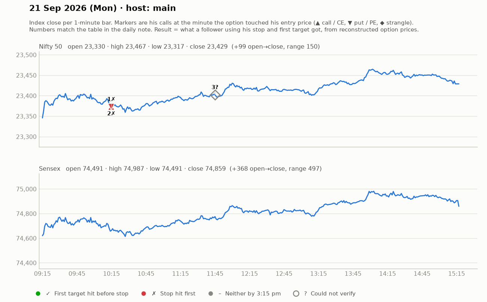

# 21 Sept (Mon) — DrmIRaTPU-A — MAIN host. Yahoo Nifty O 23330 H 23467 L 23315 C 23414 (slow grind up, low momentum).
- Pre-mkt: Gulf tension, crude -2.5% (positive), Asia green. Friday = tight-range doji (23280-23400). Small candles -> "give birth to big move". Let first 2-3 min premium decay after weekend.
- Strikes ~₹150: 23250CE, 23500PE.
## Trades
1. 9:25 23250CE: follow-up above 171-173 after breakout candle (avoid trap), SL 157->167, T1 183-184, T2 202; pullback entries 160-163 (SL 157-160). Momentum died ("futures volume dropped"); pullback buyers +10-15 (part-book), others exit BE. SCRATCH / small WIN.
2. ~10:10 23500PE: pullback to 140-142, green-candle entry, SL 136-137 (4-5 pts), T1 165-166. Entries 140-147; +10-12 part-booked, trail 147-148. small WIN.
3. ~11:30-12:15 PE/CE pullback scalps 134-136 (SL 130), T 148/158 — "8-10 pt market". small WINs/scratches.
4. Telegram CE call 158-162 -> 175-176 -> T2 done ~193. WIN (+30).
5. BankNifty idea 56500CE SL 438 T 531 (no result).
- Day described as "part-booking/trailing day, not big"; "Friday: no Telegram call because no momentum".
## Teachings
- Don't trade the breakout candle itself (mostly trapped); trade follow-up/pullback.
- On no-momentum days: tiny SLs, small targets, part-book fast; on momentum days: bigger SL & bigger targets.
- Keep strikes near ATM/slightly ITM; cheap OTM options get SL'd by premium decay.
- Let longs get trapped/flushed before entering short ("let fresh buyers' SLs hit").

## What the market actually did

Index data: 1-minute bars. "Entry hit" is the minute the reconstructed option price first traded at his entry. The follower column uses his stop and first target, else exits at 3:15 pm. Method and caveats: [market-check.md](../market-check.md).

| # | Called | Host | Option (matched strike) | Entry / SL / targets | He said | Entry hit | Market check | Follower |
|---|---|---|---|---|---|---|---|---|
| 1 | 09:32 | main | Nifty CE (23250) | 160-173 / 6-14 / 183 / 202 | SCRATCH +5 | 10:15 | No stated result; stop hit first | Stopped (-1.0R) |
| 2 | 10:06 | main | Nifty PE (23500) | 140-142 / 5 / 165-166 | WIN +11 | 10:15 | Gain came, but his stop was hit first | Stopped (-1.0R) |
| 3 | 11:45 | main | Nifty CE/PE | 134-136 / 5 / 148 / 158 | SCRATCH +3 | — | Not checkable (no time, price, or a strangle) | — |
