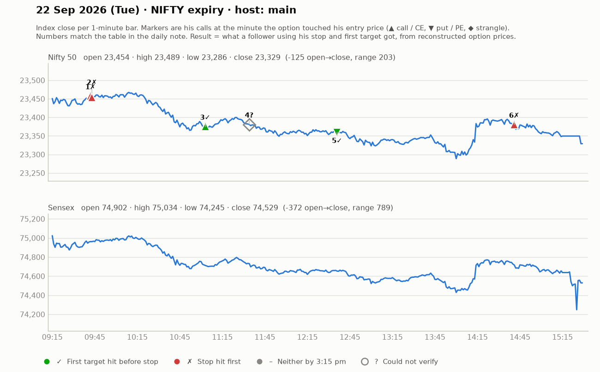

# 22 Sept (Tue, NIFTY expiry) — Dpx4i4TCkEc — MAIN host. Yahoo Nifty O 23454 H 23489 L 23286 C 23329 (opened up, fell ~170 by afternoon).
- Pre-mkt: US strong (S&P +1.5%), Asia all green; 4 green days; key level 23480 (yesterday's dot-touch, resistance). Strikes ~₹150: 23300CE, 23600PE. "Don't jump in first 1 min; let theta erode a little."
## Trades
1. 9:20 23300CE: base 145, entry above 157-158, SL 144 (system), T 173/179 (early distribution zone). Range-bound; 9:44 "initial SL lag gaya — gracefully accept" -> LOSS (~13).
2. 9:45 re-entry 159-160, SL 152-153, T 179 -> hit 170 (part-book 10 pts), stuck in cluster; exits ~BE/+5-10. ~SCRATCH/small win.
3. Put consolidation-breakout missed ("put ki rally complete miss" — SL 13 too big for him).
4. ~10:45-11:15 CE scalps 133 (SL 124-125, 8 pts) and 105 (SL 93-94), T 124: ~+8-10 part-booked. small WIN.
- At ~11:00 he says: "aaj ka din hamare liye break-even se slightly negative".
5. ~11:30 JORI (cheap CE+PE combined ₹66, SL ~₹23): put leg 31-32 -> booked 60-72 as market fell; net positive. WIN.
6. ~12:40 PE pin bar 172 (SL 162->169), T 182 then 199; Telegram put call 103-130 -> ~199 ("200 Sensex pts in 10 min at 2:05-2:15"). WIN.
7. ~2:15 CE reversal follow-up above 58 (SL 44-48), T 85 — late; outcome unclear.
## Teachings
- Doji at key zone = reversal sign; "put can't break resistance, call took support".
- Don't trade inside cluster; wait clear breakout. Don't buy a running candle (SL becomes big); trade the follow-up candle above a pin bar.
- Capital ₹20k -> SL per trade ~₹650-900 (10-12 Nifty-option pts × 65). Most traders don't book ₹650 loss and let it become ₹8-10k — "katna hi solution hai".
- ₹27-30 premiums = "bhagwan bharose", not trading.
- Jori exit: book the leg that doubles first, trail the other; multiple joris -> book one at a time; aim ~20% of combined premium.
- Uses "bias vs risk-reward": even with right bias, skip if R:R not there.
- Expiry-day margin/charges: STT etc.; "₹377 profit minus ₹80 charges".

## What the market actually did

Index data: 1-minute bars. "Entry hit" is the minute the reconstructed option price first traded at his entry. The follower column uses his stop and first target, else exits at 3:15 pm. Method and caveats: [market-check.md](../market-check.md).

| # | Called | Host | Option (matched strike) | Entry / SL / targets | He said | Entry hit | Market check | Follower |
|---|---|---|---|---|---|---|---|---|
| 1 | 09:22 | main | Nifty CE (23300) | 157-158 / 13 / 173 / 179 | LOSS -13 | 09:42 | Loss confirmed | Stopped (-1.0R) |
| 2 | 09:46 | main | Nifty CE (23300) | 159-160 / 7 / 179 | SCRATCH +5 | 09:43 | No stated result; stop hit first | Stopped (-1.0R) |
| 3 | 11:00 | main | Nifty CE (23250) | 133 / 105 / 8-11 / 124-148 | WIN +9 | 11:03 | Matches market: gain reached before his stop | First target hit (+1.9R) |
| 4 | 11:34 | main | Nifty JORI | 66 combined / 23 / +20-30 | WIN +30 | — | Not checkable (no time, price, or a strangle) | — |
| 5 | 12:40 | main | Nifty PE (23500) | 172 / 103-130 / 10 / 182 / 199 | WIN +55 | 12:36 | Matches market: gain reached before his stop | First target hit (+1.0R) |
| 6 | 14:34 | main | Nifty CE (23400) | 58 / 12 / 85-86 | UNCLEAR | 14:41 | No stated result; stop hit first | Stopped (-1.0R) |
