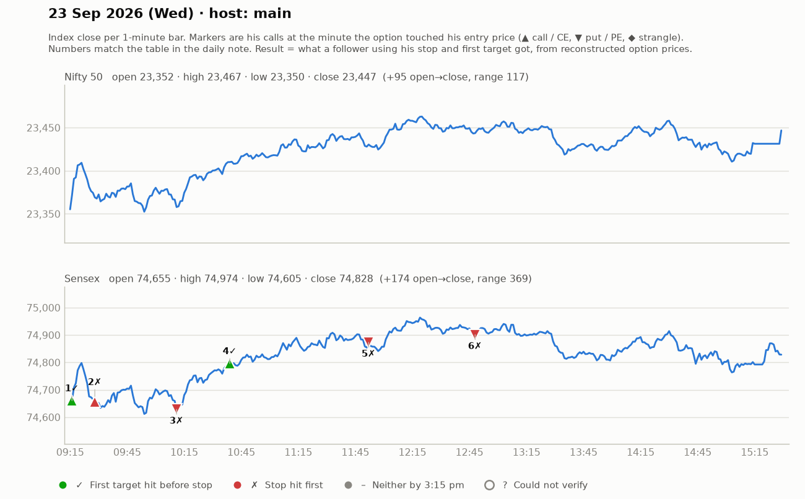

# 23 Sept (Wed) — 2yC1a6SL2Cw (MAIN host) [+ LHErabU5Wok = 7-min 3pm restart after stream deletion glitch]. Yahoo Nifty O 23352 H 23467 L 23350 C 23447 (up day). Sensex focus (expiry Thu).
- Pre-mkt: US mixed, Asia mixed; Sensex 75000/23400 Nifty = key resistance; opening 74648; "350 pt early scope"; strikes 74600CE / 74800PE (~₹300). Showed prior day call 74400CE 313->555 (+240).
## Trades
1. 9:20 74600CE above 355 (SL 325; pullback SL 302), T1 393, T2 433, T3 523 -> 9:37 "355 vale kat do" -> LOSS (~25-30).
2. 9:42 CE above 300 cluster (SL 274 "in system"), T 365 -> 9:53 "stop los hit ho gaya" -> LOSS (~20-25).
3. ~10:15 74800PE 283-285 -> distribution zone, "booked 25 points" -> WIN (small).
4. ~10:25-11:10 CE (5-min TF) 315-325, SL 269-270, T 367/433; Nifty 5-min breakout CE 120-125 -> T 161-162 (hit; Nifty 23400 target). Higher-high 378-383 SL 333 (50 pts, "mid-day SLs big"). CE reached ~384 distribution; trail 357. WIN (+20-60 depending entry).
5. ~11:55 PE 321 (SL 307) -> "kat dena 307 ke niche" -> LOSS (~14).
6. ~12:40-1:25 PE 240-247 (SL 236-237, 20-pt max risk rule), T 277 (distribution) -> part-book +15, trail 252/269 -> WIN (+15-35).
- Claims: "kal (22 Sept) ~78 lakh ka bana"; "23 June 95 lakh profit".
## Teachings
- Different market "genres": buy-on-dip / reversal / pullback markets -> adapt (why he used FVG today).
- Don't force reversal trades — small SLs keep getting hit; wait for breakout/consolidation.
- For Sensex he wants min 60-80 pt target vs ~20 SL.
- Plot general S/R on spot, but entry/SL/target on the traded option.
- When capital grows, don't scale up too fast; keep same process.
- "Adiyal" traders who refuse SL after 3-4 losses blow up.

## What the market actually did

Index data: 1-minute bars. "Entry hit" is the minute the reconstructed option price first traded at his entry. The follower column uses his stop and first target, else exits at 3:15 pm. Method and caveats: [market-check.md](../market-check.md).

| # | Called | Host | Option (matched strike) | Entry / SL / targets | He said | Entry hit | Market check | Follower |
|---|---|---|---|---|---|---|---|---|
| 1 | 09:21 | main | Sensex CE (74500) | 355-356 / 30 / 393 / 433 / 523 | LOSS -27 | 09:16 | He called it a loss; market reached 2R first | First target hit (+1.3R) |
| 2 | 09:33 | main | Sensex CE (74600) | 300 / 26 / 365 | LOSS -22 | 09:28 | Loss confirmed | Stopped (-1.0R) |
| 3 | 10:02 | main | Sensex PE (74700) | 283-285 / 15 / distribution | WIN +25 | 10:11 | Claimed gain not reached | Stopped (-1.0R) |
| 4 | 10:22 | main | Sensex/Nifty CE (74700) | 315-325 / 50 / 367 / 433 (Nifty 161) | WIN +45 | 10:39 | Matches market: gain reached before his stop | First target hit (+1.0R) |
| 5 | 11:57 | main | Sensex PE (75000) | 321 / 14 / - | LOSS -14 | 11:52 | Loss confirmed | Stopped (-1.0R) |
| 6 | 12:48 | main | Sensex PE (74900) | 240-247 / 8-10 / 277 | WIN +25 | 12:48 | Gain came, but his stop was hit first | Stopped (-1.0R) |
