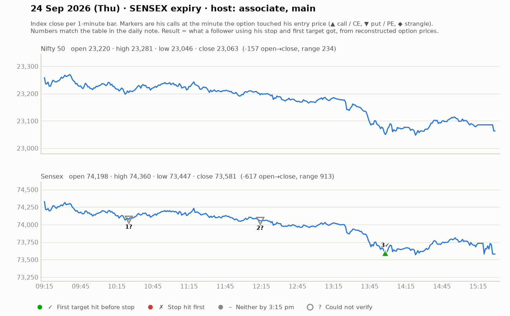

# 24 Sept (Thu, SENSEX expiry) — 1opAYBTRhww (ASSOCIATE, 9:05-1:35) + cnhIFE3Rzew (MAIN host from ~1:35pm, 1 hr). Yahoo Nifty O 23222 H 23282 L 23046 C 23063 — gap-down trend-down day (Sensex -850).
- Associate: geopolitics/crude $90+, NSDL IPO listing. Waited for 15-min structure; calls kept trapping; "aaj ek hi tred hua" by 12:20. Put Telegram call: both targets done (~374, "+50"). Put re-entry ~290. Several "cost-to-cost". Says "SL on spot/structure level, not on option premium".
- Main host (1:35pm): Sensex reached daily liquidity zone; 73600CE (₹280) bounce only above 228-230 (doji), SL day-low (~184-198, ~31-40 pts), T 260/278 — hesitant ("SL 40 too big"). Put continuation only above 425 -> T 495 (40-pt risk). Jori with 73700CE+PE: ₹2500-3000 risk, aim ~20% of engaged capital. Viewers: 74500PE 174 -> big. Outcome of his CE idea not shown (market kept falling; likely not triggered / small loss).
- Teachings: far OTM (<₹100, 3-4 strikes away) "tend to become zero"; on 40-pt-SL days reduce qty; after 3:30 he pushes MCX/crypto (CoinSwitch) for idle capital.

## What the market actually did

Index data: 1-minute bars. "Entry hit" is the minute the reconstructed option price first traded at his entry. The follower column uses his stop and first target, else exits at 3:15 pm. Method and caveats: [market-check.md](../market-check.md).

| # | Called | Host | Option (matched strike) | Entry / SL / targets | He said | Entry hit | Market check | Follower |
|---|---|---|---|---|---|---|---|---|
| 1 | 10:30 | associate | Sensex PE (74400) | ~324 / - / 374 | WIN +50 | 10:25 | Matches market: gain reached before his stop | — |
| 2 | 12:14 | associate | Sensex PE (74400) | 290 / - / - | UNCLEAR | — | His entry price never traded (per model) | — |
| 3 | 13:45 | main | Sensex CE (73900) | 228-230 / 35-40 / 260 / 278 | UNCLEAR | 13:58 | No stated result; stop hit first | First target hit (+0.9R) |
