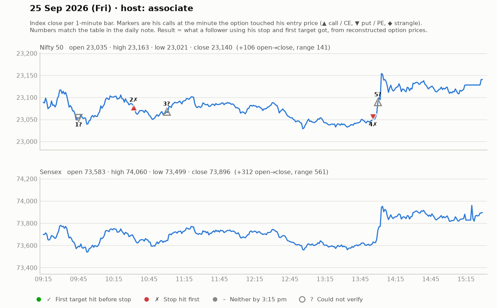

# 25 Sept (Fri) — yD4AJB3j0e4 — ASSOCIATE host all day ("Chinmay sir not available"). Yahoo Nifty O 23035 H 23163 L 23021 C 23140 (choppy, 2pm short-covering rally).
- Prev day (24th): "no trades in market, calls kept trapping; took one trade in morning then saved capital".
- Method: 15-min candle close beyond "black line"/structure shift + 1-min execution; FVG, standard-deviation targets; strikes 23000CE/23200PE (~₹200 premium; 1 lot ≈ ₹13,000).
- Trades: PE on 15m close below -> SL hit; CE long (entry ~144, booked 152-155, ~10-20 pts, "2700 profit 1 lot"); re-entries 133/152/196 -> mostly small / cost-to-cost; PE 23150 @146 -> exited ~5 pts loss; afternoon CE short-covering (+42/+20/+10 pts per his tally; Telegram calls claimed +100, BankNifty +115).
- Net: choppy; several scratches + 1-2 small SL, 2-3 small wins. "Aaj 10 point hi expect karna hai."
- Notable: VIP Telegram is unlocked by opening a broker account through their referral link + taking 1 F&O trade (i.e., VIP funded by broker referral, not a fee).
- Teachings: don't try to catch top/bottom; "15 pt loss is manageable — don't let it become 50"; weak hands lose; respect other traders; quantity small when premiums/IV high (SLs 17-20 Nifty pts).

## What the market actually did

Index data: 1-minute bars. "Entry hit" is the minute the reconstructed option price first traded at his entry. The follower column uses his stop and first target, else exits at 3:15 pm. Method and caveats: [market-check.md](../market-check.md).

| # | Called | Host | Option (matched strike) | Entry / SL / targets | He said | Entry hit | Market check | Follower |
|---|---|---|---|---|---|---|---|---|
| 1 | 09:45 | associate | Nifty PE | - / - / - | LOSS -12 | — | Not checkable (no time, price, or a strangle) | — |
| 2 | 10:15 | associate | Nifty CE (23100) | 144 / 10 / 152-155 | WIN +12 | 10:32 | Gain came, but his stop was hit first | Stopped (-1.0R) |
| 3 | 11:00 | associate | Nifty CE | various / - / - | SCRATCH +0 | — | Not checkable (no time, price, or a strangle) | — |
| 4 | 13:45 | associate | Nifty PE (23200) | 146 / 6 / - | LOSS -5 | 13:56 | Loss confirmed | Stopped (-1.0R) |
| 5 | 14:00 | associate | Nifty CE | - / - / - | WIN +30 | — | Not checkable (no time, price, or a strangle) | — |
