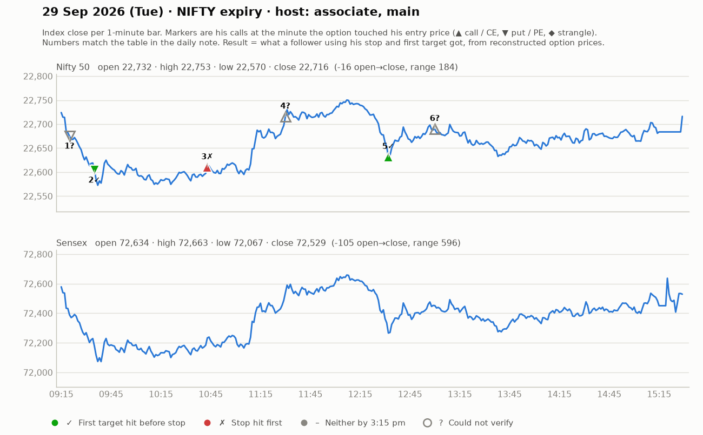

# 29 Sept (Tue, NIFTY monthly expiry + BankNifty expiry) — part1 tyvrNoWrQuA (main host, ~9:05-11:45), part2 jyeGpm8SGxo (ASSOCIATE host "Trade Circuit" channel, afternoon)
Yahoo Nifty: O 22732 H 22753 L 22570 C 22716 (fell early, recovered).
## Pre-market (main host)
- Prev day big fall; puts worked ("4 put trades, smooth"). Nifty open -47, Sensex -137. US sell-off; Asia mixed-negative. FII selling context.
- Nifty opening exactly at support zone 22732 (prior pullback zone 22550...). Below 22720 -> selling opportunities ~150 pts; if stabilizes up -> calls.
- Nifty strikes ~₹150 premium: 22600CE (~147), 22850PE (~152). "I normally trade ₹150 options; after a liquidity sweep ₹80-100 ok; NEVER ₹20-25 options — that's not trading."
- Overnight holders before expiry: premium erodes fast if open against you; limited risk only.
## Trades (main host)
1. 9:15 PE at 170 = 1:1 (SL 22, T 194) -> he passed, "1:1 not fun" (T 194 got hit anyway).
2. ~9:28 22850PE breakout of day-high: entry above 200 on follow-up candle after breakout candle, SL ~176-185 (15-24 pts), T1 206, T2 238 (Fib extension), T3 267, T4 318. "Higher-high entry -> small qty". Trail 185->208->216->230->245->259. 238, 250, 266.10 hit ("dot"). +55-66 pts. WIN (~1:3). 
3. ~9:50 22600CE bottom scalp at 103 base (SL 12-13, trail 94-98), T 130/155. ~+10-15 pts scalp. small WIN.
4. 10:00-11:00: "barcode" consolidation; CE only above 112-121. Waited. Strikes changed (22750PE, 22550CE...).
5. ~11:30 pullback entry SL HIT ("pehle pullback men esael hit"), then breakout ran. LOSS (small).
6. ~11:40 22600CE consolidation breakout: high 127 -> T 149 hit fast ("₹15 SL"). WIN.
- Telegram call that day (per associate): CE 129-133, SL 114, T1/T2/T3 -> ran to 267 (+130 pts). Also one put call -15 pts loss.
## Associate (afternoon) style
- 15-min + 1-min combined; fair value gaps, standard-deviation levels, "jhatka candle", "close above/below black line"; entries only on candle close beyond level; tiny SLs (6-14 pts) and quick exits; "cost to cost".
- States: "Win ratio ~40%, but we play risk-reward". "When we win ~137 pts, when we lose ~15 pts."
- Position scaling for big qty: book 40% at T1, 20% T2, 20% T3, hold 20%.
- "90% traders take full SL but exit targets early — do the opposite." Never hold on hope after SL.
- "Jori" (CE+PE combined premium, combined SL & target) built ~2:30pm on volatile days.
- Several small scalps 10-25 pts; one near-BE.
- Book recs: Intelligent Investor, Market Wizards.

## What the market actually did

Index data: 1-minute bars. "Entry hit" is the minute the reconstructed option price first traded at his entry. The follower column uses his stop and first target, else exits at 3:15 pm. Method and caveats: [market-check.md](../market-check.md).

| # | Called | Host | Option (matched strike) | Entry / SL / targets | He said | Entry hit | Market check | Follower |
|---|---|---|---|---|---|---|---|---|
| 1 | 09:20 | main | Nifty PE | 170 / 22 / 194 | SKIPPED | — | Not checkable (no time, price, or a strangle) | — |
| 2 | 09:28 | main | Nifty PE (22800) | 200 / 15-24 / 206 / 238 / 267 | WIN +60 | 09:35 | Claimed gain not reached | First target hit (+0.4R) |
| 3 | 09:54 | main | Nifty CE (22550) | 103 / 8 / 130 / 155 | WIN +12 | 10:43 | Gain came, but his stop was hit first | Stopped (-1.0R) |
| 4 | 11:30 | main | Nifty CE | - / - / - | LOSS -12 | — | Not checkable (no time, price, or a strangle) | — |
| 5 | 11:32 | main | Nifty CE (22600) | 127 / 15 / 149 | WIN +22 | 12:32 | Matches market: gain reached before his stop | First target hit (+1.5R) |
| 6 | 13:00 | associate | Nifty CE | various / 10 / - | WIN +15 | — | Not checkable (no time, price, or a strangle) | — |
