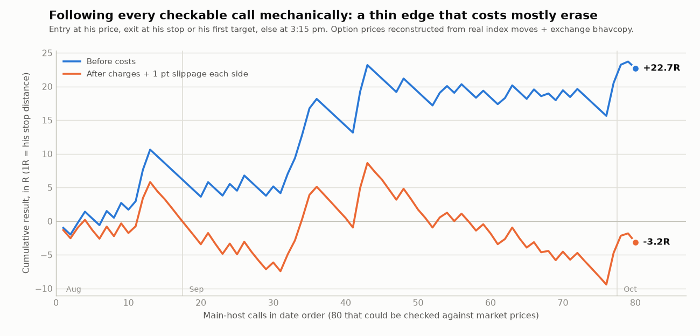
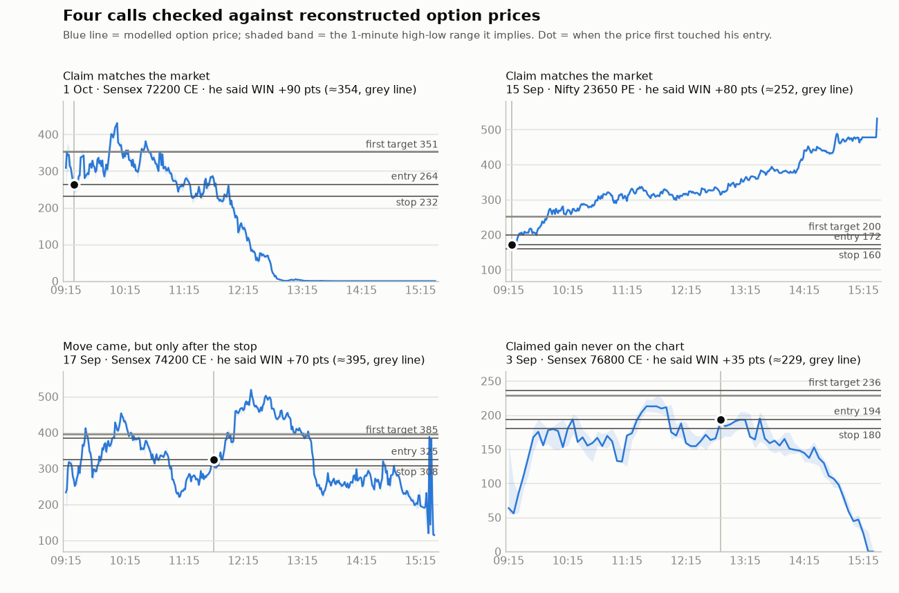

# Market check: did his calls actually work in the market?

The first pass of this analysis ([README](README.md)) used only what he **said** on stream. This file checks his calls
against **what Nifty, Sensex, and the option contracts actually did** on each of the 26 trading days. It answers two
questions:

1. When he says "target hit, +60 points", did the market really allow that?
2. If you had copied every call exactly as given, what would you have made?

## Short answer

- **The calls are real trades at real prices.** For 53 of his WIN claims I could compare the exit price he gave
  with the option's actual traded range for the day. 44 of them sat inside it. Some of his best days are confirmed by the
  market, for example 15 Sep and 1 Oct (charts below).
- **But copying the calls is much weaker than the stream makes it look.** A follower using his entry, his stop, and
  his first target would have won **40% of the time**, not ~80%. That is the same "about 40%" his co-host admitted
  on 29 Sep.
- **Before costs, the follower made +0.28R per trade.** Over 80 checkable calls that adds up to +22.7R. This is a
  small edge, and it isn't statistically proven: the 95% range is −0.10R to +0.69R.
- **After real costs it is roughly zero.** Costs here means brokerage, STT, exchange fees, and 1 point of slippage
  each way. After them, Nifty calls were barely positive (+0.05R per trade). Sensex calls were negative.
- **The main reason is his stops, not his direction.** 37 of the 48 calls that stopped a follower out later moved
  at least 2R in his direction. His read is often right, but his stops sit inside normal 1-minute noise. On stream
  the later move gets counted as a win. A follower who got stopped is simply out.

**This is not a "big money from tomorrow" system.** Details, charts, and what I'd do instead are below.

---

## What I checked against

| Data | Source | Covers |
|---|---|---|
| Nifty 50 and Sensex index bars | Yahoo Finance (^NSEI, ^BSESN) | **1-minute** bars for 4 Sep–1 Oct; **5-minute** bars for 5 Aug–3 Sep |
| Every option contract's day open/high/low/close/volume | The exchanges' official F&O bhavcopy files (NSE for Nifty, BSE for Sensex) | All 26 days, every strike |
| His calls: time, strike, entry, stop, targets, stated result | The stream captions ([trade_log.csv](trade_log.csv)) | 138 calls |

Minute-by-minute **option** prices aren't published for free, so I rebuilt them:

1. Use the real index path for that day.
2. Price each contract with Black-Scholes, using time-to-expiry to the minute.
3. Fit the implied volatility separately for each contract and day (it's allowed to drift through the day) so that
   the model hits that contract's **real** day high and low, plus its open and close where those are usable.

Example check: on 1 Oct the model puts Sensex 72200 CE at ≈253 at 9:25. He entered at 264–268. The model's day
high and low are within 6% of the exchange's.

For each call I then:
- found the strike whose model price matched the premium he quoted, around the time he gave it;
- found the first minute the option actually traded at his entry price;
- checked which came first after that: his claimed gain or his stop distance.

The four panels below show what that looks like.

- **Top row:** claims the market confirms. The entry traded, and the target came before the stop.
- **Bottom left:** 17 Sep, Sensex 74200 CE. The big move he claimed did happen, but the option first dipped through
  his 17-point stop.
- **Bottom right:** 3 Sep, Sensex 76800 CE. After his entry the option never got near his claimed +35.

The per-call result for every trade is in [`verified_calls.csv`](verified_calls.csv). Each day's chart and table are
at the bottom of that day's note in [`daily-notes/`](daily-notes/).

---

## Result 1: his 72 "WIN" claims (main host)

| Market check | Calls | What it means |
|---|---|---|
| **Matches the market**: claimed gain reached before his stop | **28** | Fully confirmed |
| Gain came, but his stop was hit first | 15 | The move was real, but a follower with his stop was out before it |
| Claimed gain not reached | 9 | The option never rose as far as he said after his entry |
| His entry price never traded (per model) | 8 | Usually a tight quoted entry the model can't reproduce; inconclusive |
| No strike matched his quoted price | 5 | Inconclusive |
| Target and stop in the same minute | 1 | Inconclusive |
| Not checkable (no time or price, or a strangle) | 6 | — |

Of the 52 WIN claims with a definite answer, **28 (54%) were clean wins** for someone using his stop. Separately, of
the 53 WIN claims where an exit price could be compared, **44 had a claimed exit inside the option's real day range**
and 9 did not. So the numbers he quotes are mostly prices that really traded. The problem is the **order of events**,
not invented prices.

## Result 2: his losses, scratches and "unclear" calls

| He said | Market check |
|---|---|
| LOSS (17) | 10 confirmed. 2 actually reached 2R before the stop (he may have used a different strike or stop). 1 he exited early. 4 not checkable |
| SCRATCH (13) | Of 8 checkable: 5 hit the stop first, 3 reached 2R first |
| UNCLEAR (13, never said how they ended) | Of 9 checkable, **8 hit the stop first**. These were almost all losses he didn't mention |

The "unclear" group is where the narration bias shows up. A follower lost on 8 of the 9 checkable calls, and nothing
on stream says so.

---

## Result 3: what a follower would actually have made

**Rules:** buy at his entry price (from the minute it traded) and use his stated stop. Exit at his first target if
it comes before the stop, otherwise at 3:15 pm. Results are in **R**, where 1R = his stop distance. 80 main-host calls
could be simulated (60 on 1-minute data, 20 on 5-minute).

| Variant | Calls | Win % | Average per call | Total |
|---|---|---|---|---|
| **His stop, his first target (base case)** | 80 | **40%** | **+0.28R** | +22.7R |
| Stop 25% wider (allow for model noise) | 80 | 45% | +0.32R | +25.9R |
| Move stop to break-even after +1R | 80 | 35% | +0.36R | +29.1R |
| Fixed 2R target instead of his first target | 80 | 44% | +0.31R | +25.0R |
| Fixed 3R target | 80 | 32% | +0.31R | +24.5R |
| Only days with 1-minute data | 60 | 42% | +0.32R | +19.1R |
| Only contracts the model fits well | 52 | 40% | +0.33R | +17.0R |
| Entries before 11:00 | 52 | 38% | +0.29R | +15.1R |
| Entries 11:00 or later | 28 | 43% | +0.27R | +7.6R |
| **Nifty options only** | 46 | 46% | **+0.44R** | +20.2R |
| **Sensex options only** | 34 | 32% | **+0.07R** | +2.5R |

The result barely moves however the rules are tweaked: about **+0.3R per call before costs**. Two more things stand
out:
- The median call loses 1R. The average is positive only because the 32 calls that reached target averaged +2.2R.
- The longest losing streak was **7 in a row**. The worst stretch before costs (17–30 Sep) gave back 7.6R.

### After costs

Round-trip charges for one lot are about **₹65 on Nifty (≈1 point)** and **₹58 on Sensex (≈3 points)**. That covers
brokerage ₹20 each way, STT on the sell, exchange fees, GST, and stamp duty. Slippage comes on top: the stream runs
3–4 seconds behind, and stops fill worse in fast markets.

| Costs per call | All 80 (average) | All 80 (total) | Nifty 46 (average) | Sensex 34 (average) |
|---|---|---|---|---|
| None | +0.28R | +22.7R | +0.44R | +0.07R |
| Charges only | +0.15R | +12.1R | +0.31R | −0.06R |
| Charges + 0.5 pt slippage each side | +0.06R | +4.5R | +0.18R | −0.11R |
| **Charges + 1 pt slippage each side** | **−0.04R** | **−3.2R** | **+0.05R** | **−0.16R** |
| Charges + 2 pts slippage each side | −0.23R | −18.4R | −0.21R | −0.25R |

**In rupees, one lot per call:**
- Nifty: ≈₹560 risked per call. The 46 calls made ≈₹14,600 before costs and ≈₹5,600 after charges + 1 pt slippage.
- Sensex: ≈₹500 risked per call. The 34 calls made ≈₹3,500 before costs and ≈₹200 after.
- That's about **₹5,800 net over two months** of copying every checkable call. The worst run after costs
  (17–30 Sep) was **−18R, about ₹9,000**.

**Is the edge real?** A bootstrap of the 80 calls gives a 95% range of **−0.10R to +0.69R** before costs (8% chance the
true edge is zero or less). After costs the range is **−0.42R to +0.37R**. Eighty calls aren't enough to tell a small
edge from luck.

### Why a follower does so much worse than his narration

1. **Stops are tighter than the noise.** His median stop was 8 points on Nifty options and 25 on Sensex. In 37 of the
   48 stopped calls, the option later moved at least 2R in his direction. See the wider-stop test below.
2. **His tally isn't a follower's tally.** In 15 of his WIN claims, the option first dipped through his stated stop.
   He may have re-entered, held through the dip, or had a slightly better price or strike, and he counted the win.
   He also trails and takes partial profits. A follower using his stated stop was simply out.
3. **The "unclear" calls were mostly losers** (8 of 9 hit the stop), and they never appear in his tally.
4. **Sensex calls were close to worthless for a follower.** 68% of them hit the stop first. The Sensex total rests
   on one day, 17 Sep (+7.0R); without it, the Sensex calls lost 4.5R before costs.

### What if you used a wider stop?

His direction was better than a coin flip. 30 minutes after entry, the index had moved his way 62% of the time
(84 calls; the 95% range is roughly 52–72%). So I re-ran the follower test with his entry and first target, but
a wider stop. Figures are 1 lot per call, after charges and 1 point of slippage per fill.

| Your stop | Win % | Net P&L, 80 calls | Avg risk per trade | Profit per ₹1 risked |
|---|---|---|---|---|
| His stop (1×) | 40% | +₹5,798 | ₹532 | 14 paise |
| 1.5× | 48% | +₹5,336 | ₹799 | 8 paise |
| **2×** | **60%** | **+₹19,138** | **₹1,065** | **22 paise** |
| 2.5× | 65% | +₹21,328 | ₹1,331 | 20 paise |

**What holds up at 2×:**
- 16 of the 48 calls that were stopped at his stop became profitable.
- With 2 points of slippage per fill it's still +₹11,798.
- Without the best day it's +₹12,183.
- It was better than 1× in both August and September.

**What doesn't:**
- 1.5× was worse than 1×, so the improvement may be partly luck.
- Most of the gain per rupee came from **Sensex** calls (1 → 32 paise per ₹1 risked).
- On **Nifty**, 2× gave more wins (59% vs 46%) and more rupees, but slightly less per ₹1 risked (16 vs 22 paise).
- Each trade risks about twice as much, so it needs about twice the capital.

`trading-system/call_helper.py` works out the wider stop, the break-even level and the size for a live call.

---

## Day by day

Each day's note in [`daily-notes/`](daily-notes/) now ends with a chart of the real Nifty and Sensex path, his calls
marked on it, and a table checking each call. "His narrated net" is the sum of the premium points he claimed (all
indices mixed). "Follower" is the base-case simulation before costs.

| Day | Nifty open→close (range) | His narrated net | Follower: calls, targets / stops, total R |
|---|---|---|---|
| [5 Aug (Wed)](daily-notes/2026-08-05.md) | −45 (171) | +245 | 2 calls, 0 / 2, −2.0R |
| [6 Aug (Thu)](daily-notes/2026-08-06.md) | +3 (71) | +140 | 1 call, 1 / 0, +1.7R |
| [7 Aug (Fri)](daily-notes/2026-08-07.md) | +36 (107) | +3 | 3 calls, 1 / 2, −0.3R |
| [18 Aug (Tue)](daily-notes/2026-08-18.md) | −68 (115) | +62 | 4 calls, 2 / 2, +2.3R |
| [20 Aug (Thu)](daily-notes/2026-08-20.md) | +7 (79) | +60 | 1 call, 1 / 0, +1.2R |
| [21 Aug (Fri)](daily-notes/2026-08-21.md) | −30 (75) | +46 | 2 calls, 2 / 0, +7.7R |
| [25 Aug (Tue)](daily-notes/2026-08-25.md) | +150 (219) | +7 | 4 calls, 0 / 4, **−4.0R** |
| [3 Sep (Thu)](daily-notes/2026-09-03.md) | −124 (149) | +115 | 3 calls, 0 / 3, **−3.0R** |
| [4 Sep (Fri)](daily-notes/2026-09-04.md) | −18 (109) | +30 | 3 calls, 1 / 2, +0.2R |
| [7 Sep (Mon)](daily-notes/2026-09-07.md) | −103 (151) | +38 | 1 call, 1 / 0, +1.7R |
| [8 Sep (Tue)](daily-notes/2026-09-08.md) | −112 (132) | +81 | 3 calls, 1 / 2, +0.2R |
| [10 Sep (Thu)](daily-notes/2026-09-10.md) | +31 (109) | co-host day | none checkable |
| [11 Sep (Fri)](daily-notes/2026-09-11.md) | +127 (216) | +30 | 5 calls, 2 / 3, +1.3R |
| [15 Sep (Tue)](daily-notes/2026-09-15.md) | **−458 (470)** | +135 | 4 calls, 4 / 0, **+11.1R** |
| [16 Sep (Wed)](daily-notes/2026-09-16.md) | +17 (168) | +80 | 4 calls, 0 / 4, **−4.0R** |
| [17 Sep (Thu)](daily-notes/2026-09-17.md) | +75 (168) | +300 | 5 calls, 2 / 3, +7.0R |
| [18 Sep (Fri)](daily-notes/2026-09-18.md) | +12 (102) | +16 | 3 calls, 1 / 2, 0.0R |
| [21 Sep (Mon)](daily-notes/2026-09-21.md) | +99 (150) | +19 | 2 calls, 0 / 2, −2.0R |
| [22 Sep (Tue)](daily-notes/2026-09-22.md) | −125 (203) | +86 | 5 calls, 2 / 3, −0.1R |
| [23 Sep (Wed)](daily-notes/2026-09-23.md) | +95 (117) | +32 | 6 calls, 2 / 4, −1.7R |
| [24 Sep (Thu)](daily-notes/2026-09-24.md) | −157 (234) | co-host most of the day | 1 call, 1 / 0, +0.9R |
| [25 Sep (Fri)](daily-notes/2026-09-25.md) | +106 (141) | co-host day | none checkable |
| [28 Sep (Mon)](daily-notes/2026-09-28.md) | −285 (318) | +168 | 5 calls, 2 / 3, +0.3R |
| [29 Sep (Tue)](daily-notes/2026-09-29.md) | −16 (184) | +82 | 3 calls, 2 / 1, +0.9R |
| [30 Sep (Wed)](daily-notes/2026-09-30.md) | −44 (214) | **+430** | 7 calls, 2 / 5, +1.1R |
| [1 Oct (Thu)](daily-notes/2026-10-01.md) | −122 (393) | +300 | 3 calls, 2 / 1, +2.2R |

Things that stand out:
- **30 Sep**, his biggest narrated day (+430 points), was only about +1R for a follower. Five of the seven
  checkable calls hit his stop first.
- **15 Sep**, a clean −458-point trend day, is where following him really paid: 4 of 4 targets.
- **25 Aug, 3 Sep, and 16 Sep** had narrated profits but would have been full losing days for a follower.

---

## Can you follow this from tomorrow?

Following every call mechanically, as given, roughly broke even after costs in this sample. If you want to try it:

1. **Paper-trade first, for at least 30 sessions.** Log your own fills, not his narration. Start real money only if
   your paper results, after costs, are positive.
2. **With his stop, Nifty only.** Sensex calls were negative for a follower after costs. With a 2× stop, Sensex calls
   did best in this sample, but that's only 34 calls.
3. **Skip a call if you missed his entry by more than 1–2 points.** Chasing turns a thin edge into a loss.
4. **Size for the losing streaks.** Expect seven losses in a row and a −15 to −20R stretch. At 1% of capital per
   trade that's a 15–20% drawdown. Don't put more than 1% at risk on any call.
5. **Set a daily stop.** For example, two losses and you're done for the day. 25 Aug and 16 Sep were 4 straight
   losses each.
6. **Put your stop and target in the system the moment you enter.** Don't wait for him to call the exit. The calls
   he never followed up on were mostly losers (8 of 9 checkable ones hit the stop).
7. **Consider about 2× his stop, keeping his entry and first target.** In this sample it raised the follower win rate
   from 40% to 60% and net P&L from about ₹5,800 to ₹19,100, but each trade risked about twice as much. Use
   `call_helper.py` to size it, and paper-test it first. It's untested beyond these 80 calls.

Context: SEBI's study found about **9 in 10 individual F&O traders lost money** over FY22–FY24. Copying someone's
calls doesn't change that by default.

---

## Caveats (read these)

- **Option prices are reconstructed, not recorded.** They are fitted to each contract's real day high, low, open,
  and close, but intraday volatility spikes, bid-ask spread, and minute-level wiggles can be off. A tight 8-point stop
  can flip between "hit" and "not hit" on model error. The variants table (25% wider stop, well-fitted contracts
  only) checks how sensitive the results are; they barely change.
- **Before 4 Sep only 5-minute index data was available** (20 of the 80 simulated calls). Those calls are less
  precise.
- **Call times are estimated from stream timestamps (±5 minutes)**, and strikes are matched by premium, so a few may
  be the neighbouring strike to the one he used.
- **He trails, takes partial profits, and re-enters.** The simulation copies only the first call with a single exit.
  That's what a follower can realistically do, but it isn't exactly his trade.
- **Telegram and VIP calls** (7) and strangles ("jori") weren't checkable. The co-host's 14 calls are in the CSV but
  not in the follower statistics.
- This covers 26 days in a falling, volatile market (Nifty −8.8%). A different market could give different results.

*Research, not investment advice.*
