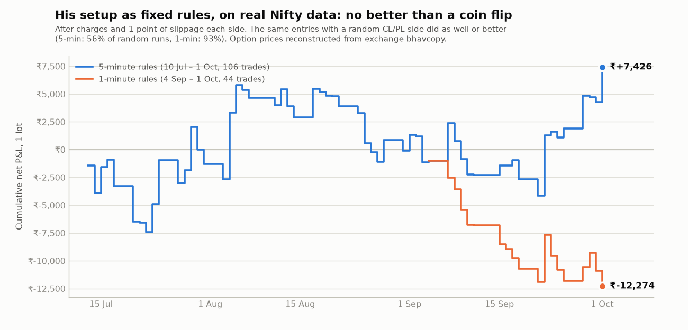

# TCI zone-breakout system for Groww: indicator, backtester, paper and live bot

> **Newest: the Fair Price playbook** ([`FAIR_PRICE_PLAYBOOK.md`](FAIR_PRICE_PLAYBOOK.md)). It's JJ Simon's
> fair-price method for the Nifty and Sensex 1-minute chart, with an indicator
> ([`tradingview/fair_price.pine`](tradingview/fair_price.pine)), a screenshot calculator app
> ([`app/fair-price-desk.html`](app/fair-price-desk.html)) and its test results.
>
> The earlier **TCI Smart Money** indicator ([`tradingview/tci_smart_money.pine`](tradingview/tci_smart_money.pine))
> is for the 5-minute chart: liquidity map, trap / retest signals, SL / T1 / MAX. Guide:
> [`tradingview/README.md`](tradingview/README.md).

This folder turns the method described in [`docs/trading-cafe-analysis`](../docs/trading-cafe-analysis/README.md) into
fixed rules that a computer can follow. It contains:
- a **TradingView indicator** you can watch while you trade in the Groww app;
- a **backtester** that uses Groww's real historical option prices;
- a **bot** that paper-trades by default and can place real orders through Groww's Trade API.

## Read this first: what the data says

I tested his main setup, written as fixed rules (below), on **real Nifty data**. The option prices were
reconstructed from the exchange's daily records ([method](../docs/trading-cafe-analysis/market-check.md)).
Results are for one lot, after charges and 1 point of slippage on each fill.

| Version | Period | Trades | Hit target | Net P&L (1 lot) | Worst drawdown | Did the signal beat random direction? |
|---|---|---|---|---|---|---|
| 5-minute candles | 10 Jul – 1 Oct 2026 (58 days) | 106 | 18 (17%) | **+₹7,426** | −₹10,038 | **No.** 56% of random-direction runs did as well |
| 1-minute candles | 4 Sep – 1 Oct 2026 (19 days) | 44 | 4 (9%) | **−₹12,274** | −₹12,274 | **No.** 93% of random runs did as well |



- **The 5-minute profit came from the market, not the signal.** Put trades made +₹21,338 and call trades lost
  −₹13,912 while Nifty fell 8.8%. Taking the same entries and stops with a coin-flip CE/PE side did just as
  well.
- **Results swing heavily with small changes.** With 2 points of slippage per fill instead of 1, the 5-minute
  result becomes −₹6,354. Accepting trades with only 1.5R to the next zone (instead of 2R) gives −₹1,387. Capping at 2 trades a day gives +₹375.
- **Copying his live calls exactly** (a separate test in
  [market-check.md](../docs/trading-cafe-analysis/market-check.md)) won 40% of the time and roughly broke even
  after costs.

So I can't honestly give you a set of rules that is proven to make money. What this folder gives you instead:
the same rules in an indicator, a backtester, and a bot, plus **guard rails that stop you risking real money
until your own results prove the rules work**. The bot only paper-trades until it has a positive record after
costs: at least 40 trades over at least 20 days.

Two months is a short test. Use `backtest.py` with your Groww API key to test a year or more of real option
prices before deciding anything.

## Wider stops, and calls and puts in both directions

### Can a wider stop catch the moves that went his way after stopping out?

**On his own calls, mostly yes, in this sample.**
- His direction was better than a coin flip: 30 minutes after entry, the index had moved his way **62%** of the
  time (84 calls; the 95% range is roughly 52–72%, so better than 50/50).
- His stops were tight enough that normal noise took many trades out before the move came.
- Keeping his entry and first target but placing the stop at **2× his stop distance** (80 checkable calls, 1 lot
  each, after charges and 1 point of slippage per fill):

| Your stop | Win % | Net P&L | Avg risk per trade | Profit per ₹1 risked |
|---|---|---|---|---|
| His stop (1×) | 40% | +₹5,798 | ₹532 | 14 paise |
| 1.5× | 48% | +₹5,336 | ₹799 | 8 paise |
| **2×** | **60%** | **+₹19,138** | **₹1,065** | **22 paise** |
| 2.5× | 65% | +₹21,328 | ₹1,331 | 20 paise |
| 3× | 68% | +₹18,913 | ₹1,598 | 15 paise |

**What holds up at 2×:**
- With 2 points of slippage per fill it's still +₹11,798.
- Without the best day (15 Sep) it's +₹12,183.
- It was better than 1× in both August and September.
- Only a 3% bootstrap chance that the true result is zero or worse.

**What doesn't:**
- **1.5× was worse than 1×.** The results jump around, so 2× may be partly luck.
- **The gain came mostly from Sensex calls.** Profit per ₹1 risked rose from 1 paisa to 32 paise. On Nifty calls, 2×
  gave more wins (59% vs 46%) and more rupees (+₹8,450 vs +₹5,590), but **less per ₹1 risked** (16 vs 22 paise).
  That is because each trade simply risked twice as much.
- **Each trade risks about twice as much money,** so you need about twice the capital for the same 1% rule.
- This is still one two-month sample in a falling market.

**On the fixed rules (the bot), no.** Their direction is no better than random, so a wider stop only magnifies
whatever the market does:
- **5-minute rules:** 1× +₹7,426, 1.5× −₹200, 2× +₹4,472, 3× −₹10,890.
- **The 2× version swings with the market.** It made +₹19,726 in September (1× made +₹8,584) and lost −₹13,594 in
  July–August (1× lost −₹87).
- **Random direction still did as well** in every version (56–91% of random runs).

A wider stop helps only when the direction is right more often than chance. His live read showed some of that.
The fixed rules didn't.

### How to use a wider stop
- **Following his live calls:** `python call_helper.py --index NIFTY --entry 172 --sl 160 --target 200 --capital 100000`.
  It prints your stop (2× his distance), the break-even move, the rupee risk per lot, and how many lots your
  budget allows.
  - It says **SKIP** when one lot is too big.
  - Don't shrink the stop to make a trade fit: the tight stop is the one that got hit 60% of the time.
- **Bot and backtest:** set `"stop_mult": 2.0` under `rules` in `config.json`. To compare widths on real Groww data:
  `python backtest.py --start 2025-10-01 --end 2026-09-30 --stop-mults 1,1.5,2`.
- **Indicator:** set the input *Stop width (x breakout-candle range)*.

### Calls (CE) and puts (PE) in both directions
The rules always look both ways:
- a breakout **up** through a zone means **buy a call (CE)**;
- a breakdown **down** through a zone means **buy a put (PE)**.

The fixed-rule results show why both matter. Over 10 Jul–1 Oct, puts made +₹21,338 and calls lost −₹13,912. In a
rising market that would flip.

Like his "CE above X, PE below Y" morning plan, the bot logs both sides whenever they change, and the indicator
shows them in a table on the chart:
```
09:40 PLAN   CALL (CE): a 5-min candle closes above 23450 (PDH/prev last-hour high/ORL), then the next candle breaks its high -> first target 23588 (ORH)
09:40 PLAN   PUT (PE): a 5-min candle closes below 23398 (PDC), then the next candle breaks its low -> first target 23383 (prev last-hour low)
```

## The rules, exactly

Nifty 50 index, 5-minute candles (the timeframe can be changed in `config.json`).

1. **Zones**, fixed at 9:15:
   - yesterday's high, low and close;
   - yesterday's last-hour high and low (from 14:00), which stand in for his "distribution" zone.

   From 9:30, today's opening range (9:15–9:30) high and low are added. Zones closer than 10 points are merged.
2. **Breakout candle:** a green candle that **closes** above a zone it opened at or below. For puts, it's a red
   candle that closes below a zone.
3. **Follow-up candle:** buy only if the **next** candle trades 1 point beyond the breakout candle's high (low for
   puts). If it doesn't, the setup is cancelled. This is his "never buy the breakout candle itself" rule.
4. **Stop:** 1 point beyond the breakout candle's other end.
   - Skip the trade if the stop is under 6 or over 35 index points away.
   - With `stop_mult` above 1, the stop sits that many breakout-candle ranges away. The skip checks still use the
     candle's range.
5. **Target:** the next zone beyond the entry.
   - Skip the trade if that zone is less than **2 × the risk** away (his "no 1:1 trades" rule).
   - If there's no zone beyond the entry, the target is 3 × the risk.
6. **After entry:**
   - move the stop to the entry price once price has moved 1 × the risk in your favour;
   - exit at the stop, the target, or 15:15.
7. **Day limits:**
   - entries only between 9:25 and 14:30;
   - at most 3 trades a day;
   - stop for the day after 2 losses;
   - at most 2 attempts at the same zone in the same direction.
8. **Option:** buy the slightly in-the-money weekly option whose premium is closest to ₹150. The bot checks the size
   against your risk budget, and **skips the trade if one lot risks more than your budget allows**.

His own trading has more judgement than this: option-chart levels, liquidity sweeps, "who is trapped", trailing,
and partial exits. Fixed rules capture the structure of his method, not his judgement. Either that judgement is
where any edge lives, or there was no edge to begin with.

## Option 1: use the indicator and trade by hand in Groww

As far as I know, Groww's charts only offer their built-in indicators and can't load custom scripts. So the
indicator runs on **TradingView** (a free account has NSE data), and you place the trade in the Groww app.

1. Open TradingView, then the chart for **NSE:NIFTY** on the **5-minute** timeframe.
2. Open **Pine Editor**, paste [`tradingview/tci_zone_breakout.pine`](tradingview/tci_zone_breakout.pine), and click
   **Add to chart**.
3. For alerts, go to **Alerts → Create alert**. Set the condition to *TCI Zone Breakout*, choose *Any alert()
   function call*, and turn on app notifications. You'll get a SETUP alert when a breakout candle closes, an ENTRY
   alert when the follow-up confirms, and an EXIT alert.
4. On an ENTRY alert, buy the ~₹150 in-the-money option in Groww. Immediately place a stop-loss order on the
   option.
   - To estimate the option stop: index stop distance × about 0.5.

I couldn't run the Pine script here, because TradingView isn't reachable from this environment. If the Pine
Editor shows an error, paste it to me. The Python engine (`tci/rules.py`) is the reference version of the rules.

## Option 2: automate through the Groww Trade API

### One-time setup
1. **Subscribe to Groww Trade API** at [groww.in/trade-api](https://groww.in/trade-api). It was ₹499 + GST a month
   when I checked.
2. On the **Groww Cloud API keys** page, click **Generate TOTP token**. That flow needs no daily approval. Keep the
   token and the TOTP secret private.
3. **Static IP.** SEBI's rules for retail algo trading require API orders to come from an IP address registered
   with your broker. Check Groww's API settings for how to register yours. A home connection usually changes IP, so
   a small cloud server with a fixed IP is the practical option. This bot sends a few orders a day, far below the
   10-orders-a-second level that needs exchange registration. The rules change, so confirm with Groww.
4. On that machine, install Python 3.9+ and then:
   ```bash
   cd trading-system
   pip install -r requirements.txt
   cp config.example.json config.json          # then edit capital and risk
   export GROWW_TOTP_TOKEN=...  GROWW_TOTP_SECRET=...
   python -m unittest discover -s tests        # 18 tests, no account needed
   ```

### Step 1: backtest on Groww's real option prices
```bash
python backtest.py --start 2025-10-01 --end 2026-09-30
```
- Downloads index and option candles, caches them in `data/cache`, and prints a summary. Every trade is saved in
  `backtest_trades.csv`.
- The "signal check" line compares the rules with random CE/PE choices at the same moments.
- **If random does as well (anything above about 5%), the rules have no edge. Don't trade them.**
- Groww's docs say historical data goes back to 2020. The pricing page mentions 3 months, so check what your plan
  allows.

### Step 2: paper trade every day
```bash
python live.py          # start before 9:15; it waits for the open
```
- Reads live prices from Groww and follows the rules. It picks and sizes the option, and "fills" at the live option
  price ± 1 point.
- Writes every trade to `journal/` and a running log to `logs/`. No orders are sent.

### Step 3: go live, only if the paper record earns it
```bash
TCI_LIVE_CONFIRM=YES python live.py --mode live
```
Live mode refuses to start unless:
- the paper journal has at least 40 trades over at least 20 days with a positive average after costs;
- you have no open F&O positions.

Start with `"max_lots": 1`.

### Safety built into the bot
- **Kill switch.** Create a file named `STOP` in the folder. The bot exits any position and takes no new trades.
- **Daily loss limit.** Default is 2% of capital, plus the rules' stop after 2 losses.
- **Size check.** It skips any trade where one lot would risk more than `risk_per_trade_pct` of capital.
- **Safety stop at the exchange.** After every buy it places an SL-M sell order at about 2 × the expected option
  risk, so a crash or a lost internet connection doesn't leave you unprotected. The order is cancelled on a normal
  exit.
- **Errors.** After 30 failed API calls in a row while in a position, it tries to exit and tells you to check the
  Groww app.
- **Square-off.** Everything is closed by 15:20 at the latest. Orders are MIS (intraday).

### How much capital this needs
- In the backtest, one Nifty lot (65 units) at these stops risked about **₹800 a trade** (median ₹793; most between
  ₹460 and ₹1,180).
- At 1% risk per trade, that needs about ₹80,000 for the typical trade and ₹1.5 lakh to take nearly all of them.
- With ₹50,000 at 1% (₹500 budget), the bot will skip most trades. That is intended: it won't over-risk to take a
  trade.
- Raising the risk percentage to get trades is how small accounts blow up.

## Files

| File | What it does |
|---|---|
| `tci/rules.py` | The rules engine: zones, setups, entries, exits, day limits. No broker code. |
| `tci/session.py` | Connects rule events to orders: option choice, sizing, paper and live brokers, journal |
| `tci/groww_client.py` | Wrapper for Groww's `growwapi` SDK (login, prices, candles, option chain, orders) |
| `tci/risk.py`, `tci/costs.py`, `tci/journal.py` | Sizing and limits; brokerage, STT, exchange fees and GST; trade journal |
| `live.py` | Paper or live session for today, or `--replay` of a saved day |
| `backtest.py` | Backtest on Groww historical index and option candles, with the random-direction check and `--stop-mults` |
| `call_helper.py` | Follow a live call with a wider stop: your stop, break-even level, rupee risk and lots |
| `FAIR_PRICE_PLAYBOOK.md` | **Fair Price** method for Nifty / Sensex 1-minute: rules, routine, ₹30k sizing, test results |
| `tradingview/fair_price.pine` | **Fair Price** indicator: fair price line, opening-candle and break-of-structure signals, stop / target, plan table |
| `tci/fairprice.py` | The Fair Price rules in Python (backtested; the reference for the indicator) |
| `app/fair-price-desk.html` | **Fair Price Desk**: reads a chart screenshot, gives entry, stop, target, strike, lots; today's trade log |
| `tradingview/tci_smart_money.pine` | **TCI Smart Money** indicator: liquidity map, trap / retest signals, SL / T1 / MAX ([guide](tradingview/README.md)) |
| `tci/smartmoney.py` | The Smart Money rules in Python (backtested; the reference for the indicator) |
| `tradingview/tci_all_in_one.pine` | **TCI All-in-One** indicator: his full method plus smart-money context ([guide](tradingview/README.md)) |
| `tci/allinone.py` | The All-in-One rules in Python (backtested; the reference for the indicator) |
| `smart_money.py` | PCR, CALL/PUT OI walls and max pain from Groww's option chain, to type into the indicator |
| `tradingview/tci_zone_breakout.pine` | The simpler zone-breakout indicator |
| `tests/test_rules.py` | Unit tests for the rules, sizing, costs and the paper session |
| `research/` | The trade lists behind the table above |

## How this was tested, and what wasn't

- **Unit tests.** 18 tests cover the rules, risk sizing, costs and the paper session.
- **End-to-end run.** `live.py` (paper and live order paths) and `backtest.py` were run against a **simulated Groww
  API**. It was built from Groww's SDK (v1.5.0) and docs, and fed real 15 Sep 2026 Nifty data. The full order
  sequence worked: limit buy, exchange stop, cancel, limit sell, journal.
- **Not tested against your real Groww account.** I don't have API access. Run `backtest.py` and a few paper days
  first. If a Groww call fails, the error will name it. The fix belongs in `tci/groww_client.py`.

Other limits:
- Signals come from the index. He reads the option chart.
- A "break-even" exit on the index can still lose a little on the option, because of time decay.
- The bot reads finished candles a few seconds after they close, so the first seconds of the follow-up candle are
  missed.
- Groww candle timestamps are assumed to be the candle's start time, which matches their docs example.

*This is a research tool, not investment advice. SEBI's study found about 9 in 10 individual F&O traders lost
money over FY22–FY24.*
