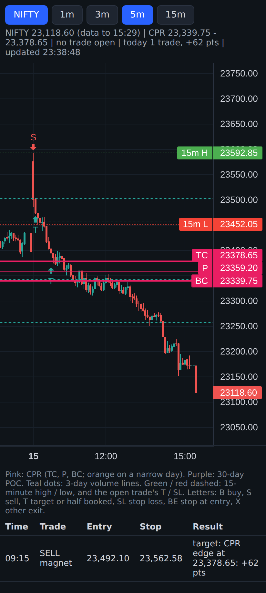

# CPR Breakout alerts: live, free, without TradingView

Free TradingView accounts now show Nifty and Sensex 15 minutes late, and the live-data add-on costs over Rs 1,000 a
month. Brokers' charts (Groww, Dhan, Zerodha) show live prices for free but can't run our own indicator.

[`cprb_alerts.py`](cprb_alerts.py) follows the same rules as the indicator (`tradingview/cpr_breakout.pine`, its
default settings) on live 1-minute candles from Upstox's free public candle data. It doesn't need an Upstox account
or a login. It tells you:

- **before 9:15:** the plan for the day: CPR, narrow or not, the 30-day POC, the 3-day volume lines, the CPR Magnet
  trigger prices;
- **9:16:** CPR Magnet BUY / SELL, or "no magnet today";
- **9:30:** the 15-minute range and the one breakout trade that is still allowed: "SELL when price touches X". Set
  a price alert in Groww at X, so you aren't late;
- **every trade:** BUY = buy the ATM call, SELL = buy the ATM put, with the stop, when to book half, when to move
  the stop, and the exit with points and rupees.

Alerts appear on the screen (with a beep) and, if you set it up, on your phone through Telegram (free).

## The live chart (free)

While the program runs, open **http://127.0.0.1:8000** in Chrome on the same phone. It's a live candle chart drawn
from the same free Upstox prices: NIFTY / SENSEX buttons, 1 / 3 / 5 / 15-minute candles, the CPR as three pink lines
(orange on a narrow day), the 30-day POC (purple), the 3-day volume lines (teal dots), the 15-minute high / low, the
open trade's stop (SL) and target (T), and every trade as a small letter: B buy, S sell, T target or half booked,
SL stop loss, BE stop at entry, X other exit. Under the chart: today's trades with entry, stop and result. It
refreshes every 5 seconds; the program fetches new prices every 15 seconds. On a weekend it shows the last session.
The chart library (TradingView's free open-source Lightweight Charts) is downloaded once and kept next to the
program. `CHART = False` at the top switches the chart off.

## Set up once

1. **Python.** On a laptop: install Python 3 from [python.org](https://www.python.org/downloads/). On Windows,
   tick "Add Python to PATH". On an Android phone: install **Pydroid 3** from the Play Store.
2. **The file.** Save `cprb_alerts.py` in a folder, for example `Documents\cprb`.
3. **Telegram (optional, for alerts on your phone):**
   1. In Telegram, open **@BotFather**, send `/newbot`, and pick a name. It replies with a token like
      `123456789:AAH...`.
   2. Open your new bot and send it any message, for example "hi".
   3. At the top of `cprb_alerts.py`, put the token between the quotes: `TELEGRAM_TOKEN = '123456789:AAH...'`.
   4. Run `python cprb_alerts.py --telegram-chat-id` (on a phone: just press Run). It prints your chat id, a
      number. Put it in `TELEGRAM_CHAT_ID = '...'`.
   5. Run `python cprb_alerts.py --telegram-test`. A test message should arrive on your phone. (On a phone, the
      "alerts started" message when you run it is the test.)
4. **Your lots.** Change `LOTS = 5` at the top if needed. It's used only for the rupee estimates (option moves are
   estimated at half the index move). `LADDER = True` switches on the volume-line ladder.

## On a Samsung phone (no computer needed)

1. From the Play Store install **Pydroid 3** and **Telegram**. That's all: the live prices come from Upstox's free
   public data, which the program fetches by itself (no Upstox app, account or login). TradingView is optional.
2. Open the copy page on the phone, tap **Copy program**. In Pydroid 3: menu, New, paste, Save as `cprb_alerts.py`.
3. Telegram alerts: do step 3 above (BotFather, then the token in the file). In Pydroid 3, open the file and press
   the yellow Run button once: it prints your chat id. Put it in `TELEGRAM_CHAT_ID`, save, and Run again: "CPR
   Breakout alerts started" arrives in Telegram.
4. Stop Android from closing it during the day:
   - Settings > Battery > Background usage limits > **Never sleeping apps** > add Pydroid 3.
   - Settings > Apps > Pydroid 3 > Battery > **Unrestricted**.
   - Keep the phone on the charger from 9:10 to 3:30. If it still stops when the screen is off, keep Pydroid 3 open
     in split screen or a pop-up window next to Groww.
5. Optional, the chart: open tradingview.com in Chrome (in DeX, or on the phone with "Desktop site" ticked), Pine Editor,
   paste the indicator, Save, Add to chart. After saving it once it is also in the TradingView app under
   Indicators > My scripts. Free TradingView is 15 minutes late, but the CPR, POC and volume lines come from
   earlier days, so they are right; the live signals come from the alerts.

**Samsung DeX** turns the phone into a desktop on a monitor or TV (cable or wireless) with a keyboard and mouse.
It is not needed, but it helps: Pydroid 3, TradingView and Groww open side by side in their own windows, so the
alerts program stays on screen all day.

## Every trading day

Open a terminal in the folder (on Windows: in the folder's address bar type `cmd` and press Enter). Then run:

    python cprb_alerts.py

On a phone: open the file in Pydroid 3 and press the yellow Run button.

Then open http://127.0.0.1:8000 in Chrome for the live chart.

Start it any time before 9:15 and leave it running until 3:30. On a laptop, plug it in and stop it from sleeping.
On a phone, keep Pydroid open and the screen on. If you start late, it shows what already happened as
"[earlier today]" and alerts only new things.

To see how it works without waiting for the market, replay any past day in a few seconds:

    python cprb_alerts.py --replay 2026-10-08

On a phone, put the date in `REPLAY_DAY = '2026-10-08'` at the top and press Run (empty it again for live).
`python cprb_alerts.py --plan` prints only the next session's plan. `python cprb_alerts.py nifty` runs one index.

## Checked

`research/quant/alerts_check.py` runs it on every 2026 session, minute by minute as it runs live. It took exactly the
backtest's trades (Nifty 101 trades, net +2,274 points; Sensex 114 trades, net +8,102; with the ladder +2,193 /
+8,819). Nothing it had already said changed later in the day. The CPR uses the exchange's official daily close
(downloaded each morning), like TradingView; the official close often differs from the last 1-minute candle.

## Limits

- An alert comes when the 1-minute candle in which something happened has closed, plus a few seconds for the data.
  CPR Magnet (9:16) and volume-line trades (at a 5-minute close) are fine with that. For a breakout, use the 9:30
  message to set a price alert in Groww.
- The data is Upstox's public candle feed. It worked without a login when this was written. If Upstox changes it,
  the script will say "data error".
- It only sends alerts. You place the orders yourself in Groww.
- The rules were adjusted on 2026 itself, so live results will very likely be lower than the backtest.
