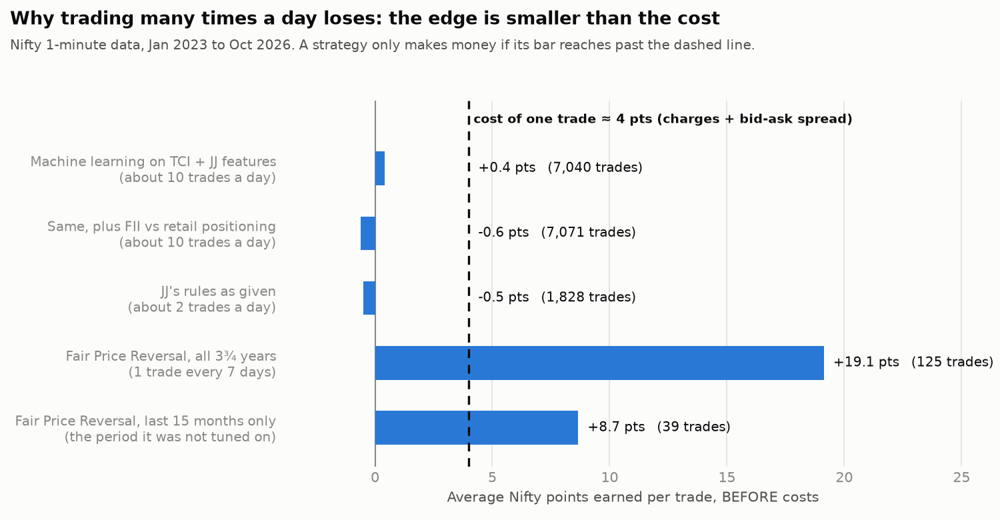
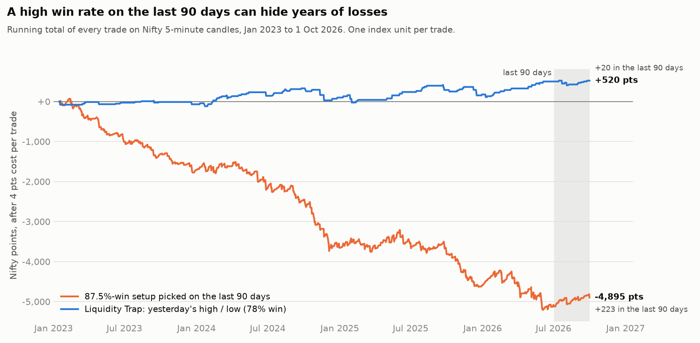
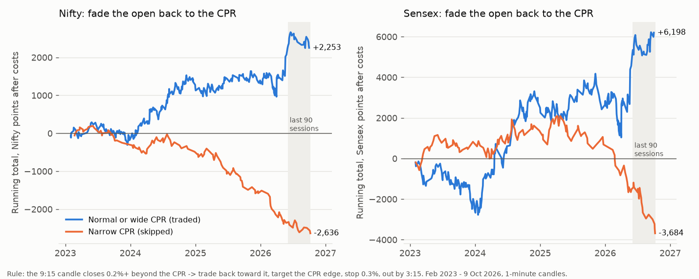

# What the tests show, in plain words

## What a backtest is

A backtest replays the past one minute at a time. At each minute the rules see only what had happened up to
then, decide whether to buy or sell, and the trade is closed at its stop, its target or 3:15, exactly as if it
were live. Every trade pays its costs. Add up all the trades and you see what the rules would have made.

The data: every 1-minute Nifty and Sensex candle from January 2023 to October 2026 (915 trading days, Upstox's
public candle API), plus NSE's daily positions of FIIs, DIIs, proprietary desks and retail clients ("participant
wise open interest") for the same days.

## The one number that decides everything: cost per trade

Buying and selling one option lot costs brokerage, STT, exchange fees, GST and the bid-ask spread. Together
that's about ₹130 per lot, which equals about **4 Nifty points** of index movement (an at-the-money option moves
about half as much as the index). A typical 30-minute Nifty move is 17 points, so every trade starts about a
quarter of a typical move behind.

To make money, a strategy's average trade has to beat 4 points before costs. The chart above shows that nothing
that trades often comes close.

## What was tested

| Approach | What it is | Result after costs |
|---|---|---|
| JJ Simon's rules as given | Opening-candle trade, then trades back to the 9:15 open | Nifty −358R over 1,828 trades, lost every year |
| 1,800 variations of JJ's rules | Stops, targets, zone distance, swing size, window, break-even, loss limits | Almost all lose. Best: Fair Price Reversal (below) |
| TCI + JJ combined | A liquidity sweep of a TCI level (yesterday's high / low, opening range) that pulls price back toward JJ's fair price; 144 variations | 40 looked good on 2023 to mid-2025, 11 stayed positive afterwards, all small. The best one in the tuning years lost −57R afterwards |
| Opening-range breakout, Supertrend, EMA crossovers | 488 variations of common indicator strategies | About break-even at best |
| Machine learning | A model reads 26 measurements every 5 minutes (TCI levels, sweeps, JJ's distance from the open, momentum, time of day, gap) and predicts the next 15 / 30 / 60 minutes. Each month it learns only from earlier months | Right 51 to 52% of the time (a coin flip is 50%). About 10 trades a day: −25,200 Nifty points over 680 days |
| Retail vs smart money | FII, retail (Client) and Pro positions in index futures and options, published by NSE every evening | Lines up slightly with the next morning's gap, which you can't trade because the data comes out after the close. Says nothing useful about 9:15 to 3:30. Added to the model, results got worse |

R means one stop-loss amount. −358R means the rules lost 358 times what one stop costs.

## Why the 19-day test looked good

Over 19 days, a strategy with no real edge can easily look profitable, the same way a coin can land heads 12
times in 19. The longer test (915 days) is what tells the truth.

## What did hold up

**Fair Price Reversal** on Nifty: trade only after price has moved far from the 9:15 open (about 94 points), on a
1-minute close back toward it, with a wide stop (about 39 points) and a 1 : 3 target (about 118 points). Its
average trade earns about 19 points before costs, so it clears the 4-point cost. It's positive in every year
from 2023 to 2026. But:

- It trades about once a week, not 10 times a day. That's why it works: it waits for the rare big move, where
  the edge is bigger than the cost.
- In the 15 months it wasn't tuned on, it earned less (about 9 points per trade before costs, +2R in total),
  and June to September 2026 lost money.

## "80% win rate" setups on the 5-minute chart

I searched 1,820 five-minute setups (TCI liquidity traps at yesterday's high / low, the opening range, swings
and the day's high / low; JJ's fair-price reversal; trend pullbacks) with small targets and wide stops, which is
how you get a high win rate.

- **523 of them won 80% or more in the last 90 days** (3 July to 1 October 2026). A high win rate is easy:
  take profit after a few points and give the stop lots of room.
- Only 16 of those 523 made money in those 90 days. Wins were small and losses big: a typical one won
  +12 points and lost −55.
- Only 1 also made money in the 90 days before that, and none did over the full 3¾ years.
- The busiest one won 87.5% of 64 trades in the last 90 days (+223 points). Over 3¾ years it won 77.5% and
  lost −4,895 points. That's the orange line above.

One setup held up on Nifty: **Liquidity Trap**, a stop hunt at yesterday's high or low. A 5-minute candle trades
about 8 points beyond the level and closes back inside; target about 25 points, stop about 59. Results:

- Nifty: 105 trades in 3¾ years (about one every 9 days), 78% won, +520 points after costs. It lost a little in
  2023 and made money in 2024, 2025 and 2026.
- Last 90 days: 10 trades, 80% won, +20 points.
- Sensex: the same rules lost −2,017 points. Treat the Nifty result as thin.

It's in `tradingview/liquidity_trap.pine` as a TradingView strategy, so TradingView's Strategy Tester shows the
same numbers on your own chart.

## Breakout, pullback, ride: trades every day

I tested 960 versions of: a breakout through a level (yesterday's high / low, the opening range, today's
swings), with or without a "real breakout" filter (a strong or expanding candle); a pullback to the level; a
reversal candle (close past the previous candle, engulfing, or pin bar); then a fixed target, a trailing stop or
holding to 3:15.

- 448 of them traded at least 0.8 times a day in the last 90 days. 43 made money there, 7 also in the 90 days
  before, 5 also over all 3¾ years, and 3 also on Sensex.
- **Win rates were 20-40%, never 70-80%.** Riding a move means many small losses (stopped or scratched at
  entry) and a few big wins. 11 versions won 70%+ in the last 90 days; none of them made money.
- The best all-round version, **Breakout Retest**: real breakout (candle range at least 1.5× the last six),
  pullback within about 12 points of the level, entry on a close past the previous candle, stop about 29
  points, stop to entry after +15, then a trail about 59 points behind the best close.
  - Nifty: 1,482 trades (1.6 a day), 25% won, average win +77 and loss −24, +1,621 points after costs.
    Last 90 days +163, the 90 days before +975, but 2025 lost −1,546. About 2 days in 3 lost money.
  - Sensex: +3,334 Sensex points over all years, but −154 in the last 90 days and −5,224 in 2025.
  - **Random buy / sell directions with the same entries and exits did as well in about 1 run in 5.** The
    profit comes mostly from cutting losers fast and riding the occasional trend, not from calling direction.

It's in `tradingview/breakout_retest.pine` as a TradingView strategy.

## 15-day levels, volume profile and consolidations

Levels rebuilt every morning from the last 15 days: every daily high and low, profile peaks (prices where the
most trading happened), and consolidations (an hour or more inside a narrow band). Lines within about 10 Nifty
points are merged into one. The Nifty index has no volume, so this test uses time spent at each price (the
classic market profile); the TradingView indicator can use Nifty futures volume instead.

I tested 1,296 versions: rejection candles at the levels (pin bar or engulfing, then trade back), or strong
breakout candles through them; which levels to use; how close counts as a touch; stop size; target at the next
level or a fixed multiple.

- 774 versions traded at least 0.8 times a day in the last 90 days. 24 made money there; none of those also made
  money in the 90 days before.
- **Rejection candles at the levels lost money**: −3,161 Nifty points and −27,882 Sensex points over 3¾ years
  using all the lines.
- **Adding profile peaks and consolidations to the trade levels made results worse** (Nifty −1,964 with them,
  +1,863 without).
- What held up: a **strong breakout candle through a "double" daily level**, where two or more of the last 15
  daily highs / lows sit within about 10 points. Stop about 12 points back across the level, target the next
  such level at least 2× the stop away.
  - Nifty: 719 trades (0.8 a day), 36% won, average win +72 and loss −36, +1,863 points after costs, positive
    in each of 2023, 2024, 2025 and 2026. Last 90 days −132, the 90 days before +138.
  - Random buy / sell directions with the same entries, stops and targets did as well in only 2% of runs.
  - Sensex: +3,304 Sensex points, but it lost in 2023 and 2026.

It's in `tradingview/levels_15d.pine`. It draws all the lines (15-day highs / lows, VOL, CONS, merged) and
trades only the tested breakouts unless you switch that off.

## All four strategies together

Fair Price Reversal, Liquidity Trap, Breakout Retest and 15-Day Levels on Nifty, one unit each, February 2023 to
1 October 2026 (901 days), after 4 points cost per trade. Their daily results are almost unrelated (correlations
between −0.10 and +0.21), so they don't all lose on the same days.

| Version | 2023 | 2024 | 2025 | 2026 | Last 90 days | All | Trades a day | Red days |
|---|---|---|---|---|---|---|---|---|
| All four | +1,963 | +2,218 | −554 | +2,354 | −13 | +5,981 | 2.7 | 56% |
| All four, skip a trade when another strategy signalled the opposite way in the last 30 minutes | +1,853 | +2,720 | +79 | +2,750 | +168 | **+7,403** | 2.5 | 56% |
| Only trades a second strategy confirmed within 30 minutes | +146 | +910 | +100 | +1,050 | +153 | +2,206 | 0.3 | 13% |

- Trades that another strategy contradicted lost on average for all four strategies (−2 to −23 points each),
  so skipping them is the one combination rule that helped everywhere. I found it after seeing these results, so
  treat it as promising, not proven.
- Even with that rule: more days lose than win (56% red), 16 of 45 months lost, the longest losing run was 10
  days, and the deepest fall was −2,461 points (June to December 2025). On one Nifty option lot (delta 0.5)
  that's about −₹80,000.

## "Breakout Probability (Expo)" on 15-minute candles

The indicator counts how often, in the chart's history, the next candle went above the current candle's high
(or below its low), split by whether the current candle is green or red, plus four more lines 0.1% further out.

- On Nifty 15-minute it shows almost the same numbers on every candle: after a green candle about 67% for a new
  high, after a red candle about 68% for a new low. In the 30 days to 7 October 2026 it never reached 70%.
  The further lines were 17% or less.
- Its strongest calls (65%+, 483 of them) were right 62% of the time by its own measure: the next candle
  touched the level, even by a fraction of a point.
- 30 minutes after the call: +7.7 points on average when it was right, −14.0 when it was wrong.
- Trading every call for 30 minutes lost −2,180 Nifty points after costs; entering only when the level broke
  lost −773. Sensex was similar (−4,731 and −906 Sensex points).
- On 3-minute candles it was the same: about 69% after a green candle and 67% after a red one, never 70%.
  Its 2,409 strongest Nifty calls were right 68% of the time, but 30 minutes later price was only +3.9 points
  ahead when right and −5.3 behind when wrong. Trading them lost −7,456 points (−4,696 entering only on the
  break); Sensex lost −22,491 and −10,201 points.

### Scalping its calls at 1 : 2

Same calls, but each one traded as a quick scalp: stop X points, target 2X, out at whichever comes first (checked
minute by minute), one trade at a time. Two entries: at the call candle's close, or only if the next candle
breaks the level. Stops of 5, 10, 15 and 20 Nifty points (Sensex scaled to its price).

- At 65% the indicator calls **every candle**: its line hardly moves, so there's always a 65%+ number on one side.
  That's about 120 calls a day on 3-minute candles and 24 on 15-minute.
- The target was hit before the stop 29-41% of the time. A coin toss hits a 2X target before an X stop about 33%
  of the time, so the calls add little. After costs you need 60% (stop 5), 47% (stop 10), 42% (stop 15) or
  40% (stop 20).
- Nifty 3-minute, last 30 days: every version lost, from −6,349 points (enter at close, stop 5) to −338 points
  (enter on the break, stop 20 / target 40, 8 of 21 days green). The 12 months before: all lost, from −83,100 to
  −11,828.
- Sensex 3-minute, last 30 days: all lost (best −69 Sensex points, enter on the break, stop 20); the 12 months
  before lost −35,438 to −260,529.
- 15-minute candles: Nifty lost in every version (best −379 in 30 days; −6,767 or worse in the 12 months before).
  The only profit in the whole test was Sensex 15-minute, enter on the break, stop 20 / target 40: +550 Sensex
  points in the last 30 days, but −19,039 over the 12 months before.

### Did it ever show 90%?

Every 3- and 5-minute candle from early 2023 to 7 October 2026, with the numbers worked out from the last 5,000
candles, as a live chart would show them.

- **It never showed 90%, or even 75%.** Highest ever: Nifty 72.5% (3-minute) and 73.6% (5-minute), Sensex 71.1%
  and 73.3%. It counts thousands of candles, so one new candle barely moves the number.
- Its highest 1% of readings (about 71-74%) lost on every test: Nifty −2,122 (3-minute) and −1,786 (5-minute)
  points scalping at 1 : 2, worse when held 30 minutes. Sensex lost too.
- With a short memory (only the last 50 candles), it does show 90%+, about once every 2-3 days. Those calls were
  mixed: Nifty 5-minute held 30 minutes made +1,203 points over 471 trades (about +2.6 a trade after costs), but
  Nifty 3-minute lost −847 with the same rule and Sensex 5-minute lost −4,124. 4 of 12 combinations made money,
  about what luck gives.

## CPR and pivots

CPR (central pivot range) from the previous day's high, low and close: pivot P = (H + L + C) / 3, BC = (H + L) / 2,
TC = 2P − BC. "Narrow" means today's CPR is among the narrowest third of the last 20 days.

**What repeated (last 60 sessions, 16 July to 9 October 2026, and every day since 2023):**

- **A narrow CPR did not bring bigger days.** Nifty's narrow-CPR days moved 0.69% high to low on average in the
  last 60 sessions; wide-CPR days moved 0.82%. Since 2023: 0.87% vs 0.98%, and a 1%+ day happened 30% of the time
  on narrow days and 34% on wide ones. Sensex was the same. The CPR's width is just two-thirds of the distance between
  yesterday's close and the middle of yesterday's range (close near the middle = narrow), so it doesn't measure
  a squeeze.
- **When the day opens above the CPR, price comes back to it about two times in three** (Nifty 63%, Sensex 66%
  since 2023), and the same when it opens below. Days that opened above it closed lower slightly more often than
  not (53-56%).
- In the last 60 sessions, Sensex days that opened above a CPR that wasn't narrow closed lower 12 times in 16.
  Since 2023 that happened only about half the time (54%).

**What I tested:** 576 rule versions in five families: fade the open back to the CPR; opening-range breakout,
with or without the narrow-CPR filter; a 5-minute close through the CPR; a poke through R1 / S1 that closes back;
and holding all day for or against the CPR. Entries and exits on 1-minute candles, after costs.

- **The best versions in the last 60 sessions were luck.** On Nifty they were opening-range breakouts (best
  +585 points); on Sensex, holding all day in the open's direction on narrow-CPR days (best +2,238 Sensex
  points). All 15 best on each index lost in the 30 sessions before. Since 2023, 12 of the Nifty 15 and 10 of the
  Sensex 15 lost, and each of the rest had at least one losing year.
- **Picked on February 2023 to June 2025 only**, the top 3 versions (hold all day against the CPR on narrow
  days) lost afterwards on both indices. The next 7 included 5 "fade back to the CPR on normal or wide days"
  versions, and all 5 made money afterwards on both.

**What held up: CPR Magnet.** Skip narrow-CPR days. If the 9:15 one-minute candle opens above the CPR and closes
at least 0.2% above it, sell at that close (9:16); if it opens below and closes 0.2% below, buy. Target the near
edge of the CPR, stop 0.3% of price (about 68 Nifty points), out by 3:15.

| | Trades | Won | Total after costs | Per trade | Last 90 sessions | Deepest fall |
|---|---|---|---|---|---|---|
| Nifty | 313 (1.7 a week) | 50% | +2,253 pts | +7.2 | 26 trades, +5 | −673 |
| Sensex | 294 | 49% | +6,198 pts | +21.1 | 25 trades, +1,055 | −3,139 |
| Nifty, same rule on narrow days | 142 | 37% | −2,636 | −18.6 | | |

- Same entries, stop and target distance, but a coin toss for the direction: as good in only 2 of 300 runs, on
  both indices.
- Weak spots: both lost in 2023 (Nifty −180, Sensex −2,444). Nifty lost −282 in the last 60 sessions, when the
  market kept falling and the buys back toward the CPR were stopped out. About half the profit came from two
  months (May and June 2026 on Nifty). Not every nearby setting works: about half of the "fade on normal days"
  versions made money on Nifty since 2023.

It's in `tradingview/cpr_magnet.pine`.

## Open vs the CPR, the 15-minute break, and the 15-day profile

Your ideas, checked on the last 90 sessions (3 June to 9 October 2026) and on every day since 2023:

| Idea | Last 90 sessions | Since 2023 |
|---|---|---|
| Opens above the CPR, so the day goes up: closed higher than the open | Nifty 47%, Sensex 37% | Nifty 47%, Sensex 44% |
| Opens below the CPR, so the day goes down: closed lower than the open | Nifty 49%, Sensex 52% | Nifty 50%, Sensex 49% |
| Opens above the CPR: still above the CPR at the close | Nifty 69%, Sensex 60% | Nifty 70%, Sensex 66% |
| First 5-minute close beyond the 15-minute high / low: still that way at the close | Nifty 48%, Sensex 54% | Nifty 51%, Sensex 51% |
| Same break: reached 1R before the stop at the other side of the range | Nifty 33%, Sensex 28% | Nifty 36%, Sensex 34% |
| Same break: reached 3R (a 1:3 target) before the stop | Nifty 2%, Sensex 0% | Nifty 5%, Sensex 4% |

So neither idea is right much more than half the time on its own. The CPR does tend to hold as a floor or
ceiling by the close (about two days in three).

I tested 3,888 combinations: open-vs-CPR direction, the 15-day point of control (POC, the price traded most in 15
days; time at price, since the index has no volume) and its value area, the 5-minute EMA 50, today's CPR vs
yesterday's, CPR width, entry on a 5-minute close or a touch, three stops, a 1:3 target / ride / trail, and an
optional reversal trade after a failed break.

- **None won 80% of its trades** in the last 90 sessions (10+ trades). Best: Sensex 77% of 13 trades; Nifty 63% of 30.
- 216 made money in the last 90 sessions and since 2023 on both indices; none made money every year on both.
- Picked on February 2023 to June 2025 only, 2 of the top 50 made money afterwards. 50 of those 50 used the
  open-vs-CPR filter, which stopped working after mid-2025.
- What held up best: **breakouts on narrow-CPR days.** Trade only when today's CPR is among the narrowest third of
  the last 20 days. Don't sell when today's CPR is wholly above yesterday's, or buy when it's wholly below. Enter
  on a touch of the 15-minute high or low, with the stop at the other side of the range. After +1R, trail the stop
  1R behind the best price. If the first trade loses, take the break of the other side once.

| | Last 90 sessions | Since 2023 | By year 2023 / 2024 / 2025 / 2026 |
|---|---|---|---|
| Nifty | 34 trades, 20 won / 14 lost, +1,068 / −807, **net +262** | 276 trades, 51% won, +1,896 | −181 / +1,277 / −118 / +918 |
| Sensex | 31 trades, 22 won / 9 lost, +3,985 / −1,986, **net +1,998** | 272 trades, 53% won, +7,296 | −50 / +4,340 / −1,394 / +4,401 |
| Nifty, same rules on days that are not narrow | 51 trades, −518 | 593 trades, −2,300 | |

- With the reversal trade, narrow days beat other days on both indices in both halves of the data (before and
  after July 2025), for every exit style. Without the reversal trade they were not better before July 2025. It's
  your friend's narrow-CPR idea in breakout form, and the one pattern here that looks real.
- Average win about +53 and loss −58 Nifty points: 1:3 targets were rarely reached, so the fixed 1:3 version made
  less (Nifty last 90 +86, since 2023 +866).
- The open-vs-CPR filter cut trades and profit (Nifty since 2023 +1,570, Sensex +2,306). The POC filter lowered
  it too (+1,433 and +3,828); the value-area filter turned Sensex into a loss (−1,023).
- I chose these settings after seeing all the results, so treat them as promising, not proven.

It's in `tradingview/cpr_breakout.pine`.

## How to re-check all of this

- `python research/fair_price_backtest.py` downloads the candles and re-runs the Fair Price test.
- `research/quant/`: the machine-learning, combination and sentiment tests (see the README there).
