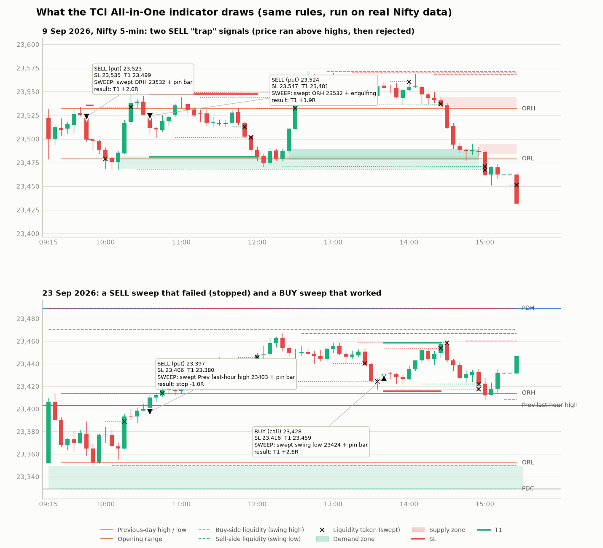

# TCI All-in-One indicator: plain-language guide

One TradingView indicator that puts his whole method on your chart and gives **BUY / SELL signals with SL and
targets on the index**.

File: [`tci_all_in_one.pine`](tci_all_in_one.pine) · Example of what it draws: [`all-in-one-preview.png`](all-in-one-preview.png)

## Put it on your chart (one time, about 2 minutes)

1. Open [tradingview.com](https://www.tradingview.com) (a free account is fine) and open the **NIFTY** chart
   (`NSE:NIFTY`) on the **5-minute** timeframe.
2. At the bottom, click **Pine Editor**. Select everything in it and delete it, so it's empty. Paste the **whole**
   of `tci_all_in_one.pine`, then click **Save** and **Add to chart**.
   - The second line must be `//@version=5`.
   - If you see "compile as Pine v1", or errors at `rSweep += r` or `else`, that line didn't get pasted. Empty the
     editor and paste the full file again.
3. For phone alerts: **Alerts (clock icon) → Create alert → Condition: TCI All-in-One → "Any alert() function
   call" → Create**.

For SENSEX, open `BSE:SENSEX` and in the settings set **Option strike step** to 100 and the futures symbol to
`BSE:SENSEX1!`.

## What you'll see

| On the chart | What it means (his words) |
|---|---|
| Blue lines **PDH / PDL**, grey **PDC** | Yesterday's high, low and close: his "previous-day key zones" |
| Purple lines | Yesterday's last-hour high and low: where the last "distribution" happened |
| Orange **ORH / ORL** | First 15 minutes' high and low |
| Red dashed lines | **Buy-side liquidity.** Swing highs where sellers' stop-losses sit. **EQH** = equal highs, a bigger pool |
| Green dashed lines | **Sell-side liquidity.** Swing lows where buyers' stop-losses sit. **EQL** = equal lows |
| Line turns dotted | That liquidity was taken (price ran through it): "liquidity le li" |
| Green / red boxes | **Demand / supply zones**: the base a strong move started from. Only the **first** touch is traded |
| Pink line | Futures VWAP, shifted to the index. Above = buyers in control, below = sellers |
| Thick red / green lines | CALL / PUT OI walls you typed in (resistance / support) |
| Pink diamond at the bottom | A big-volume candle in futures (big players active) |
| Orange **"BUY setup" / "SELL setup"** label | A setup formed. **Don't enter yet** |
| Teal **BUY** / maroon **SELL** label | Entry confirmed. It shows the index entry, **SL, T1, T2, T3**, the reason, and an option strike idea |
| Small grey / green / red label | The exit: target, SL, breakeven or square-off, with the result in R |

**The three setups:**
- **SWEEP (the trap).** Price runs past a liquidity line, taking the stops, then the candle closes back inside as a
  **pin bar or engulfing** candle. This is the "everyone was long, he said short" trade.
- **ZONE.** First touch of a fresh demand or supply zone with a pin bar or engulfing candle, in line with the trend.
- **BREAKOUT.** A strong candle closes through a key level.

Every signal waits for his follow-up rule: the next candle must break the signal candle. If it doesn't, nothing
happens.

**The table at the top right:**
- **Bias:** a score from −4 to +4. It adds up structure (up or down), price vs yesterday's close, price vs today's
  open, and price vs the middle of the opening range.
- **VWAP, PCR, OI walls:** the smart-money context.
- **Liquidity:** the nearest levels above and below.
- **Now:** the active trade or setup.
- **Today:** trades so far. It says **DONE FOR THE DAY** after 4 trades or 2 losses (his rules).
- **Scorecard:** how the indicator's own signals did on all the history loaded on your chart. Check this before
  trusting it.

## Every morning (2 minutes)

1. Open the **option chain** in the Groww app for the nearest Nifty expiry. Note:
   - the **PCR**;
   - the strike with the **highest CALL OI** (resistance);
   - the strike with the **highest PUT OI** (support).

   If you have the Groww Trade API, `python smart_money.py` prints all three.
2. In TradingView, open the indicator's settings (gear icon) → *Smart money context* → type the three numbers in.

## Taking a signal in Groww

The SL and targets are **index** levels. To trade the **option** in Groww:
1. Buy the suggested strike: about ₹150 premium, slightly in the money.
2. Work out your option stop. An option moves about 0.5 points for each 1 point of index move.
   - Example: index SL 30 points away → option SL ≈ entry premium − 15.
3. Place that stop-loss order in Groww straight away.
4. Exit when the index reaches T1, or follow the indicator's exit label.

**Size it so that hitting the SL costs at most 1% of your capital.** One Nifty lot (65) with a 15-point option
stop risks about ₹1,000.

## Did it work? Tested on real data, so you know

I ran the same rules (Python version: `../tci/allinone.py`) on real Nifty prices. Option prices were rebuilt from
the exchange's daily records. Results are for one lot, after charges and 1 point of slippage on each fill.

| Test | Trades | Win % | Net P&L | Worst drawdown | Better than random? |
|---|---|---|---|---|---|
| 5-minute chart, 10 Jul – 1 Oct 2026 (58 days) | 71 | 37% | **−₹3,270** | −₹11,279 | **No** (random direction did as well 40% of the time) |
| 1-minute chart (SL limits 4–25 pts), 4 Sep – 1 Oct 2026 (19 days) | 54 | 31% | **−₹6,560** | −₹7,550 | **No** |
| 5-minute with "only trade with the bias" switched on | 51 | 37% | +₹1,477 | −₹9,725 | No (40%) |

By setup on the 5-minute test:
- **SWEEP:** 27 trades, −₹6,148.
- **BREAKOUT:** 43 trades, +₹1,444.
- **ZONE:** 1 trade, +₹1,434.

**Does it think like him?**
- When he gave a Nifty call, the indicator's most recent signal pointed the same way **62%** of the time on
  5-minute (24 calls) and **79%** on 1-minute (19 calls).
- Its bias score matched his direction only about 55% of the time, which is close to a coin flip.

**What this means:** the indicator sees the market the way he describes it. It finds his levels, traps and pin
bars, and often leans the way he did. **But taking every signal automatically did not make money** in these three
months. I also tried a few sensible variations (follow-up within 2 candles, more room to target, wider SL, earlier
cut-off). None was reliably better than random.

His results come from the parts that don't fit into fixed rules: which signals he skips, reading the option chart,
trailing, and re-entering. So:
- Use the indicator to **see** liquidity, traps and zones, and as his checklist.
- Don't use it as an autopilot.
- Watch the **Scorecard** row on your own chart, and paper-trade before risking money.

## What I could and couldn't check

- **Syntax:** checked with a Pine parser. I can't open TradingView from here. If it shows an error when you click
  *Add to chart*, copy the error message to me and I'll fix it.
- **PCR and OI:** TradingView has no NSE option-chain data, so these are typed in by you (or from
  `smart_money.py`). They change the drawn walls, the targets and the dashboard. They were **not** part of the
  backtest.
- **VWAP and volume:** these come from the futures contract (`NSE:NIFTY1!`), because the index itself has no
  volume. They're for display only.
