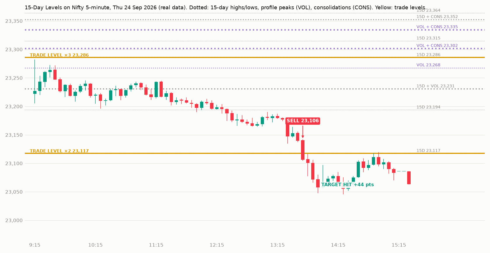
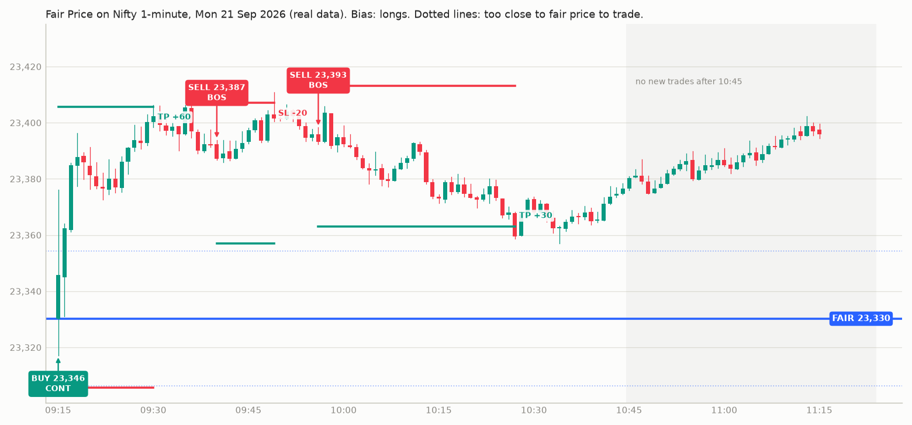
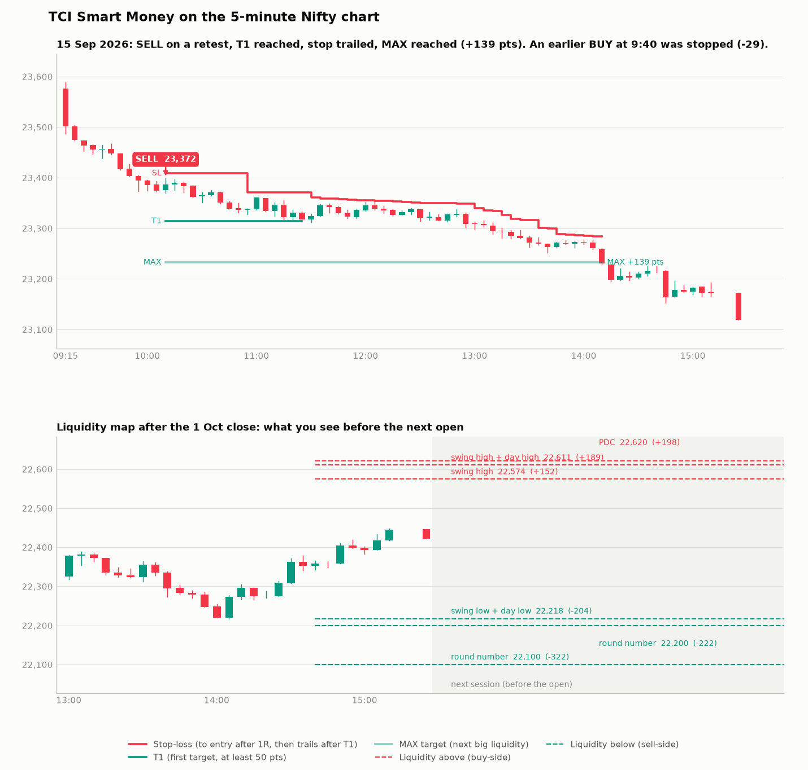
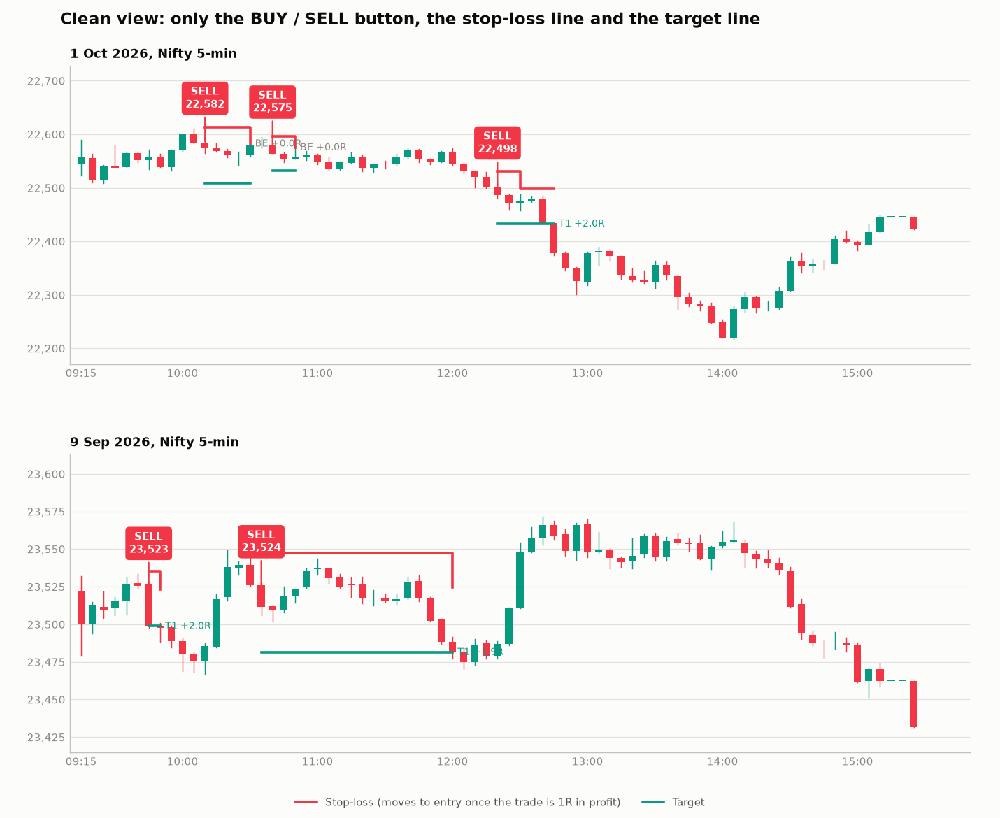

# TCI indicators for TradingView: plain-language guide

## CPR Breakout (newest): daily plan, Nifty or Sensex, 5-minute chart

File: [`cpr_breakout.pine`](cpr_breakout.pine). An indicator; reads 1-minute candles underneath for exits.

- Draws the CPR as three pink lines: TC (top), the pivot P (middle) and BC (bottom), from yesterday's official
  high, low and close; orange on narrow days, with its width in the box ("55 pts (0.25%) normal"). The CPR
  shows on any intraday chart; the trades need a 5-minute chart. Also the first 15-minute candle's high and low,
  the 30-day volume point of control (purple, the price where the most NIFTYBEES volume traded) with its value
  area, and (if switched on) the EMA 50.
- **Default = daily plan, one plan per day.** Narrow-CPR day: CPR Breakout scalp. Other day: CPR Magnet at 9:16
  if the open is 0.2%+ beyond the CPR, otherwise the CPR Breakout scalp.
  - CPR Magnet: trade back toward the CPR, stop 0.3%, book half at 0.25 x the risk, stop to entry, rest to the
    CPR edge.
  - CPR Breakout scalp: opening-gap direction, not against today's CPR vs yesterday's, only on the volume side of
    the 30-day POC, a touch of the 15-minute high / low before 10:00, stop at the other side, book half at 0.25 x
    the risk, stop to entry, trail the rest.
- CPR Magnet also trades only on the volume side of the 30-day POC (sells below it, buys above). In 2026 that cut
  most of the losing trades.
- 2026 (1 Jan - 9 Oct, CPR from the official close): Nifty 64 trades, 56 won / 8 lost, +1,623 / −567, net +1,056;
  Sensex 62 trades, 59 won / 3 lost, +4,391 / −716, net +3,675. With "skip days that open outside yesterday's
  high-low range" switched on: Nifty 44 won / 5 lost, net +1,039; Sensex 42 won / 1 lost, net +3,010.
- **Plus 3-day volume lines** (teal dots), in the same book, one trade at a time: a 5-minute close through a line
  between 9:30 and 2:30 trades toward the next line, with the stop at the previous line, when the target is at
  least 1.5x the stop away.
  - 2026 with the volume lines: Nifty 101 trades (about 11 a month), 79 won / 22 lost, net +2,274 points; Sensex
    114 trades (about 12 a month), 85 won / 29 lost, net +8,102.
  - Optional **ladder** (off by default): at the next line book half, move the stop to the broken line, ride the
    rest to the line after. 2026: Sensex net +8,819 (instead of +8,102), Nifty +2,193 (instead of +2,274); all of
    the gain came in January-June.
- Today's lines are named at the right edge: TC / P / BC (the CPR), POC, 15m high / low, vol (3-day volume lines),
  and SL / T for an open trade. After the close, the **next session's CPR** is drawn dashed to the right with its
  width, so on a weekend you already see Monday's levels. (A CPR is fixed for its whole session: it comes from the
  previous day's high, low and close.) The value area lines are off by default.
- Chart marks are small letters by the candles: **B** buy, **S** sell, **T** target or half booked, **SL** stop
  loss, **BE** stop at entry, **X** any other exit. Tap a letter for the prices and points. Dashed red / green
  lines show the open trade's stop and target.
- Every filter is in Settings. `research/quant/y2026_combo.py` has the same plan in Python.
- **No live data on free TradingView?** [`alerts/cprb_alerts.py`](../alerts/cprb_alerts.py) runs the same rules on
  free live data and sends the alerts to your phone through Telegram. Setup: [`alerts/README.md`](../alerts/README.md).

## CPR Magnet: Nifty or Sensex, any 1 to 15-minute chart, at most one trade a day

File: [`cpr_magnet.pine`](cpr_magnet.pine). An indicator. It reads 1-minute candles underneath, so it works on a
1, 3, 5 or 15-minute chart.

- **Blue band**: today's CPR (from yesterday's high, low and close), with the pivot line inside. **Orange band**:
  a narrow CPR (narrowest third of the last 20 days), meaning no trade today. Red lines R1-R3, green S1-S3.
- **SELL** at 9:16 when the 9:15 one-minute candle opens above the CPR and closes at least 0.2% above it;
  **BUY** when it opens below and closes at least 0.2% below. **TARGET** the near edge of the CPR, **STOP** 0.3%
  of price (about 68 Nifty points), out by 3:15. The label shows all three; dashed lines show target and stop.
- The box shows today's trigger prices (SELL at or above / BUY at or below), so you can use them on a live chart
  even though free TradingView is 15 minutes late, plus the next session's levels after 3:30 and the score on
  the chart's history.
- Tested Feb 2023 to 9 Oct 2026 after costs: Nifty 313 trades, 50% won, +2,253 points (last 90 sessions +5);
  Sensex 294 trades, 49% won, +6,198 points (last 90 sessions +1,055). Both lost in 2023. Random directions did
  as well in 2 of 300 runs. `research/quant/cpr_magnet_check.py` has the same rules in Python.

## Combo 4: all four strategies on one Nifty 5-minute chart

File: [`combo4.pine`](combo4.pine). Runs Fair Price Reversal (on 1-minute candles read inside each 5-minute
candle), Liquidity Trap, Breakout Retest and 15-Day Levels together. A signal is **skipped** when a different
strategy signalled the opposite direction in the last 30 minutes; otherwise it's a **TAKE** with a big BUY / SELL
label, STOP and TARGET (Breakout Retest trails its stop instead of a target). The box keeps score of the taken
trades: open trades, today, the whole chart, the last 90 days, and what the skipped signals would have made.

It's an indicator, not a strategy, because the four can hold a BUY and a SELL at once, which the Strategy Tester
can't. Tested on Nifty, Feb 2023 to Oct 2026: +7,403 points after costs, about 2.5 trades a day, every year
positive (2025 only +79), last 90 days +168; 56% of days red; deepest fall −2,461 points.
`research/quant/combo4_mirror.py` is a line-by-line Python copy that reproduces those numbers.

## 15-Day Levels: Nifty 5-minute chart

File: [`levels_15d.pine`](levels_15d.pine). A TradingView **strategy** (Strategy Tester shows its results).

- **Dotted lines**, rebuilt every morning from the last 15 days: daily highs and lows (15D), volume-profile
  peaks (VOL) and consolidations (CONS). Lines within about 10 points are merged; thicker means more things line
  up there. Volume comes from Nifty futures (`NSE:NIFTY1!`), since the index has none; if it isn't available it
  uses time at price. The nearest 6 above and 6 below are shown.
- **Yellow TRADE LEVELS**: two or more of the last 15 daily highs / lows within about 10 points.
- **BUY / SELL** when a strong candle (body 60%+ of the candle, closing in its top / bottom quarter) closes
  through a trade level. **STOP** about 12 points back across the level; **TARGET** the next trade level at
  least 2× the stop away.
- Tested on Nifty, Jan 2023 to Oct 2026 (time at price): 0.8 trades a day, 36% won, wins +72 / losses −36,
  +1,863 points after costs, positive every year; last 90 days −132. Random directions did as well 2% of the time.

## Breakout Retest: Nifty 5-minute chart, 1-2 trades a day

File: [`breakout_retest.pine`](breakout_retest.pine). A TradingView **strategy**: open the Strategy Tester tab for
its results on your chart.

- Dashed lines: the levels it watches (yesterday's high / low, opening range, today's swings).
- **BUY / SELL** after a real breakout (an expanding candle through a level), a pullback to the level, and a
  candle that closes past the previous one. The label shows the entry and **STOP** (about 29 Nifty points). The
  red line follows the stop: to entry after +15 points, then trailing about 59 points behind the best close.
- Tested on Nifty, Jan 2023 to Oct 2026: 1.6 trades a day, 25% won, wins +77 / losses −24 on average,
  +1,621 points after costs, but 2025 lost and random directions did as well 1 time in 5. Details:
  [`../research/WHAT_THE_TESTS_SHOW.md`](../research/WHAT_THE_TESTS_SHOW.md).

## Liquidity Trap: Nifty 5-minute chart, high win rate

File: [`liquidity_trap.pine`](liquidity_trap.pine). A TradingView **strategy** for the **NIFTY 5-minute chart**:
open the Strategy Tester tab to see its win rate and profit on your own chart, after 4 points of costs per trade.

- Red and green lines mark **yesterday's high and low**, where stop-losses sit.
- **SELL**: a candle goes about 8 points above yesterday's high and closes back below it. **BUY**: the same at
  yesterday's low. The label shows the entry, **STOP** (about 59 points away) and **TARGET** (about 25 points away).
- The box at the top right says exactly what would trigger a trade now, plus the results on your chart: all
  trades and the last 90 days.
- Tested on Nifty, Jan 2023 to Oct 2026: 105 trades, 78% won, +520 points; last 90 days 10 trades, 80% won,
  +20 points. One loss costs about three wins. Sensex lost with the same rules. Why most 80% setups lose:
  [`../research/WHAT_THE_TESTS_SHOW.md`](../research/WHAT_THE_TESTS_SHOW.md).

## Fair Price Reversal: Nifty 1-minute chart

File: [`fair_price.pine`](fair_price.pine). Made for the **NIFTY 1-minute chart**. Full rules, the 915-day test
and what it means for your money: [Fair Price playbook](../FAIR_PRICE_PLAYBOOK.md).

- **Blue line**: the fair price (the 9:15 open).
- **Dotted lines**: the BUY ZONE below and the SELL ZONE above. Only moves this far from the open are traded
  (about 94 Nifty points in October 2026; the distance adjusts to recent days by itself).
- **BUY / SELL label**: a candle closed beyond the latest swing, back toward the open. The label shows the entry,
  the **STOP** and the **TARGET**, and red and green lines mark them. Stop about 39 Nifty points, target 3 times that.
- **TARGET HIT / STOP HIT / 3:15 EXIT**: how the trade ended.
- **Box at the top right**: what to do now (wait, which level to watch, the trade you're in, or done for today).
- Alerts: condition "Fair Price Reversal", "Any alert() function call".

On 915 days of data it made +43R on Nifty over 125 trades, positive every year. But the last 15 months only
broke even and the last four lost. Sensex is weaker. His original rules lost heavily over the same period.

## TCI Smart Money (5-minute chart)

File: [`tci_smart_money.pine`](tci_smart_money.pine). Copy it with the button on the copy page.
Made for the **NIFTY 5-minute chart**.

### What you see
- **Liquidity map, always on, also before the open.** Dashed lines run into the future: red for the nearest 3 levels
  **above** price, green for the nearest 3 **below**. These are where stop-losses sit, the places smart money
  drives price to:
  - highs and lows of the last 5 sessions that haven't been taken yet (PDH, PDL, "Thu high" and so on);
  - previous week high and low (PWH, PWL);
  - major swing highs and lows on the 5-minute chart (6 candles each side), shown as EQH/EQL when two are equal;
  - today's opening range (ORH, ORL);
  - the previous close (PDC, the gap-fill level);
  - the OI walls you type in.

  If there aren't 3 real levels on a side (for example at a fresh multi-day low), round 100s fill in.
- **The plan table** (top right) lists those levels with their distance from price. It writes his "CE above X, PE
  below Y" plan from them, plus the open trade, today's count, and a scorecard of past signals on your chart.
- **Signals:** a green **BUY** button below the candle, or a red **SELL** button above it. The arrow points at the
  candle and the entry price is on the button, so the candle stays visible. Hover the button for the SL, T1, MAX, the
  reason and an option strike idea.
- **Trade lines:** red **SL**, green **T1** (minimum target), light green **MAX** (the maximum target: the next big
  liquidity).

### The rules
| | |
|---|---|
| **TRAP** (on) | Price runs through a liquidity level, taking the stops, and the 5-min candle closes back with a pin bar, engulfing candle or strong close. Trade the other way. This is the "everyone long, he says short" move |
| **RETEST** (on) | A level broken in the last hour is retested and holds. Trade in the break direction |
| **BREAK** (off) | A strong candle closes through a level. Off because it lost money in the test (false breakouts) |
| Entry | Only when one of the next 2 candles breaks the signal candle (his follow-up rule) |
| SL | Just beyond the signal candle or the swept level: 15–40 points, about 26 on average. Skipped if over 40 |
| T1 | The first liquidity level at least **2 × the SL** away: **1:2 or better** (or exactly 2 × SL if there's none) |
| MAX | The next liquidity level after T1: the "maximum you can get" |
| Managing | His rule: **book half at 1:1 and move the SL to entry**. After T1, the SL on the rest trails 2 × ATR behind the best price, like a Supertrend line. Exit at MAX, the trailing SL, or 3:15 pm |
| Day limits | Entries 9:20–11:00 and 2:00–2:45 (paused at mid-day), at most 4 trades, stop after 2 losses |

All of these numbers can be changed in Settings → Inputs.

### Monday morning (or any morning) before 9:15
1. Open the 5-min Nifty chart. The map already shows the nearest liquidity above and below, from the last sessions,
   the week and the swings.
2. Optional: type the PCR and the highest CALL and PUT OI strikes from Groww's option chain into Settings → Smart money
   context. The walls get drawn and are used as targets.
3. Read the **Plan** row. For example: "SELL if price runs above 22,611 and a 5-min candle closes back below it.
   BUY if price runs below 22,218 and closes back above it. After a clean break, wait for the retest."
4. Wait for the button. Don't trade the open or the break candle itself.

### Tested on real Nifty data (5-min, 17 Jul – 1 Oct 2026, 1 lot, after charges and 1 pt slippage per fill)
| | |
|---|---|
| Trades | 53 on the default settings |
| Outcome | **31 ended in profit (58%)**, 21 losses, 1 flat. Average profit +32 pts, average loss −24 pts |
| Net | **+₹16,735**, worst drawdown **−₹5,079**; never more than 3 losses in a row |
| By month | July +₹2,728, August +₹3,800, September +₹11,693, 1 Oct (2 trades) −₹1,485 |
| Without the 3 best trades | +₹1,752 |
| Better than random? | Random direction at the same moments did as well 6% of the time |

### Can it win 90% of the time at 1:2? No, and neither can TCI
Win rate and reward pull against each other. This is the same set of signals with the stop just beyond the level
and different targets (no breakeven move):

| Target | Win rate | Average result per trade |
|---|---|---|
| 0.25 × SL | 63% | −0.21R (loses money) |
| 0.5 × SL | 63% | −0.05R |
| 1 × SL (1:1) | 50% | 0.00R |
| 2 × SL (1:2) | 36% | −0.02R |
| 3 × SL (1:3) | 32% | −0.01R |

- Every step up in reward costs win rate. 90% wins only happen with tiny targets, and those lose money overall.
- 90% at 1:2 would mean +1.7R on every trade. Nobody sustains that. TCI's own co-host said their win rate is about
  40%, and copying his calls exactly won 40% of the time
  ([market-check.md](../../docs/trading-cafe-analysis/market-check.md)).
- What raises the win rate **without** shrinking the winners is his own management: **book half at 1:1 and move the
  SL to entry**. That turned 39% winners into 58–63% that end in profit.
- **10-point stops don't work on the 5-minute chart.** The stop just beyond a real level averages about 26 points.
  Tighter stops sit inside normal noise and get hit first. They also tested worse with targets at 1:2 and 1:3.

### Why most trades didn't win in the first version (79 test trades)
- **34 full stop-outs.** 20 of them never went even 10 points our way: the signal was simply wrong. Another 10 went
  +15 to +24 and then reversed.
- **19 came back to entry.** They went a median +39 points our way first, but none reached a 50-point T1. The SL
  had moved to entry, so they cost only charges.
- **Losers clustered at mid-day.** Entries between 11:00 and 13:59: 25 trades, 12% winners, −₹11,611. That was
  true in both July–August and September, and it matches his own rule that mid-day is chop. **Now paused by
  default.**
- **Other patterns didn't hold up.** Some looked strong in one half of the data but not the other, so they are not
  rules. Levels from the previous day did better (40% winners) than opening-range levels (13%). Stops of 26–40
  points did better than forced 25-point stops on small candles. Trades against the last hour's move (traps)
  won more often.
- **One idea backfired.** Capping T1 at 70 points looked good on paper, but did worse when re-run properly.

**Honest limits:**
- I chose these defaults after looking at this data, and 11 weeks is short.
- Most of the profit came from three trend days in September.
- Expect losing weeks. Paper-trade first, and watch the Scorecard row on your own chart.

### Your earlier requests, and where they are
- **Buttons off the candle, with an arrow:** done (below the candle for BUY, above it for SELL).
- **Level-based SL and targets at 1:2 or better:** done. The SL sits just beyond the level and T1 is the next liquidity at least 2 × SL away. Set *Minimum SL* to 25 and *Also at least this many points* to 50 if you prefer the earlier rule.
- **Maximum profit:** the MAX line plus the trailing SL after T1. Switch on *Exit fully at T1* if you prefer to book
  everything at T1. In earlier tests that earned less, because the big trend days pay for everything else.
- **Levels before the open:** the liquidity map and the plan table.

---

## Older version: TCI All-in-One
One TradingView indicator that puts his whole method on your chart and gives **BUY / SELL signals with SL and
targets on the index**.

File: [`tci_all_in_one.pine`](tci_all_in_one.pine)

**By default it's clean:** a green **BUY** or red **SELL** button at the entry price, one red **stop-loss** line
and one green **target** line while the trade is open, and a small "+2.0R / −1.0R" note at the exit. The stop-loss
line steps to the entry price once the trade is 1R in profit. Hover the button to see the reason, T2, T3 and an
option strike idea.

Everything else (liquidity lines, zones, previous-day levels, VWAP, the dashboard) is still calculated. Each one can
be switched on under **Settings → Inputs → Display**. Full view: [`all-in-one-preview.png`](all-in-one-preview.png).

### Put it on your chart (one time, about 2 minutes)

1. Open [tradingview.com](https://www.tradingview.com) (a free account is fine) and open the **NIFTY** chart
   (`NSE:NIFTY`) on the **5-minute** timeframe.
2. At the bottom, click **Pine Editor**. Select everything in it and delete it, so it's empty. Paste the **whole**
   of `tci_all_in_one.pine`, then click **Save** and **Add to chart**.
   - The second line must be `//@version=5`.
   - If you see "compile as Pine v1", or errors at `rSweep += r` or `else`, that line didn't get pasted. Empty the
     editor and paste the full file again.
3. For phone alerts: **Alerts (clock icon) → Create alert → Condition: TCI All-in-One → "Any alert() function
   call" → Create**.

**If it shows up in a separate panel under the chart instead of on the candles:** hover the indicator's name →
**⋯ (More)** → **Move to** → **Existing pane above**. Or delete it from the chart (bin icon) and click **Add to
chart** again.

**To hide the row of numbers next to its name:** right-click the indicator → **Settings → Style** → untick **Inputs in
status line** and **Values in status line**.

For SENSEX, open `BSE:SENSEX` and in the settings set **Option strike step** to 100 and the futures symbol to
`BSE:SENSEX1!`.

## Everything it can draw (switch on in Settings → Display)

| On the chart | What it means (his words) |
|---|---|
| Blue lines **PDH / PDL**, grey **PDC** | Yesterday's high, low and close: his "previous-day key zones" |
| Purple lines | Yesterday's last-hour high and low: where the last "distribution" happened |
| Orange **ORH / ORL** | First 15 minutes' high and low |
| Red dashed lines | **Buy-side liquidity.** Swing highs where sellers' stop-losses sit. **EQH** = equal highs, a bigger pool |
| Green dashed lines | **Sell-side liquidity.** Swing lows where buyers' stop-losses sit. **EQL** = equal lows |
| Line turns dotted | That liquidity was taken (price ran through it): "liquidity le li" |
| Green / red boxes | **Demand / supply zones**: the base a strong move started from. Only the **first** touch is traded |
| Pink line | Futures VWAP, shifted to the index. Above = buyers in control, below = sellers |
| Thick red / green lines | CALL / PUT OI walls you typed in (resistance / support) |
| Pink diamond at the bottom | A big-volume candle in futures (big players active) |
| Orange **"BUY setup" / "SELL setup"** label | A setup formed. **Don't enter yet** (off by default) |
| Green **BUY** / red **SELL** button | Entry confirmed, at the index entry price. Hover for SL, T1–T3, the reason and an option idea (set *Signal label* to Detailed to write it all on the chart) |
| Red line / green line | The stop-loss and the target of the open trade |
| Small green / red text | The exit, with the result in R (+2.0R = twice the risk) |

**The three setups:**
- **SWEEP (the trap).** Price runs past a liquidity line, taking the stops, then the candle closes back inside as a
  **pin bar or engulfing** candle. This is the "everyone was long, he said short" trade.
- **ZONE.** First touch of a fresh demand or supply zone with a pin bar or engulfing candle, in line with the trend.
- **BREAKOUT.** A strong candle closes through a key level.

Every signal waits for his follow-up rule: the next candle must break the signal candle. If it doesn't, nothing
happens.

**The table at the top right:**
- **Bias:** a score from −4 to +4. It adds up structure (up or down), price vs yesterday's close, price vs today's
  open, and price vs the middle of the opening range.
- **VWAP, PCR, OI walls:** the smart-money context.
- **Liquidity:** the nearest levels above and below.
- **Now:** the active trade or setup.
- **Today:** trades so far. It says **DONE FOR THE DAY** after 4 trades or 2 losses (his rules).
- **Scorecard:** how the indicator's own signals did on all the history loaded on your chart. Check this before
  trusting it.

## Every morning (2 minutes)

1. Open the **option chain** in the Groww app for the nearest Nifty expiry. Note:
   - the **PCR**;
   - the strike with the **highest CALL OI** (resistance);
   - the strike with the **highest PUT OI** (support).

   If you have the Groww Trade API, `python smart_money.py` prints all three.
2. In TradingView, open the indicator's settings (gear icon) → *Smart money context* → type the three numbers in.

## Taking a signal in Groww

The SL and targets are **index** levels. To trade the **option** in Groww:
1. Buy the suggested strike: about ₹150 premium, slightly in the money.
2. Work out your option stop. An option moves about 0.5 points for each 1 point of index move.
   - Example: index SL 30 points away → option SL ≈ entry premium − 15.
3. Place that stop-loss order in Groww straight away.
4. Exit when the index reaches T1, or follow the indicator's exit label.

**Size it so that hitting the SL costs at most 1% of your capital.** One Nifty lot (65) with a 15-point option
stop risks about ₹1,000.

## Did it work? Tested on real data, so you know

I ran the same rules (Python version: `../tci/allinone.py`) on real Nifty prices. Option prices were rebuilt from
the exchange's daily records. Results are for one lot, after charges and 1 point of slippage on each fill.

| Test | Trades | Win % | Net P&L | Worst drawdown | Better than random? |
|---|---|---|---|---|---|
| 5-minute chart, 10 Jul – 1 Oct 2026 (58 days) | 71 | 37% | **−₹3,270** | −₹11,279 | **No** (random direction did as well 40% of the time) |
| 1-minute chart (SL limits 4–25 pts), 4 Sep – 1 Oct 2026 (19 days) | 54 | 31% | **−₹6,560** | −₹7,550 | **No** |
| 5-minute with "only trade with the bias" switched on | 51 | 37% | +₹1,477 | −₹9,725 | No (40%) |

By setup on the 5-minute test:
- **SWEEP:** 27 trades, −₹6,148.
- **BREAKOUT:** 43 trades, +₹1,444.
- **ZONE:** 1 trade, +₹1,434.

**Does it think like him?**
- When he gave a Nifty call, the indicator's most recent signal pointed the same way **62%** of the time on
  5-minute (24 calls) and **79%** on 1-minute (19 calls).
- Its bias score matched his direction only about 55% of the time, which is close to a coin flip.

**What this means:** the indicator sees the market the way he describes it. It finds his levels, traps and pin
bars, and often leans the way he did. **But taking every signal automatically did not make money** in these three
months. I also tried a few sensible variations (follow-up within 2 candles, more room to target, wider SL, earlier
cut-off). None was reliably better than random.

His results come from the parts that don't fit into fixed rules: which signals he skips, reading the option chart,
trailing, and re-entering. So:
- Use the indicator to **see** liquidity, traps and zones, and as his checklist.
- Don't use it as an autopilot.
- Watch the **Scorecard** row on your own chart, and paper-trade before risking money.

## What I could and couldn't check

- **Syntax:** checked with a Pine parser. I can't open TradingView from here. If it shows an error when you click
  *Add to chart*, copy the error message to me and I'll fix it.
- **PCR and OI:** TradingView has no NSE option-chain data, so these are typed in by you (or from
  `smart_money.py`). They change the drawn walls, the targets and the dashboard. They were **not** part of the
  backtest.
- **VWAP and volume:** these come from the futures contract (`NSE:NIFTY1!`), because the index itself has no
  volume. They're for display only.
